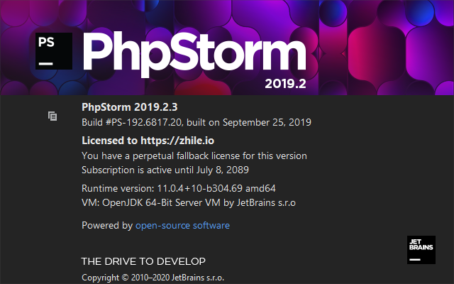

### JetBrains 破解
  - jetbrains-agent.jar
  - reset_jetbrains_eval_mac_linux.sh 或 reset_jetbrains_eval_windows.vbs
  - 工具下载地址：`https://pan.baidu.com/s/1K0C6ZfFv4ipdbTF5Cf36Bw 提取码: xrqm`

### 步骤
1. 下载工具
2. 启动 IDE
  - 选择 **Evalute for free** 试用
  	如果试用已过期运行 reset_eval 文件夹中的脚本，再重启 IDE 选择 Evalute for free
	```
	MAC 或 Linux 运行 reset_jetbrains_eval_mac_linux.sh
 	Windows 运行 reset_jetbrains_eval_windows.vbs
	```
  - 将 lib 文件夹中的 **jetbrains-agent.jar 拖进 IDE 窗口**，在弹出的对话框中**点击安装**
  - **重启 IDE**，激活完成

[](./images/jetbrains_crack.png)

### 适用范围
理论上适⽤于⽬前Jetbrains全系列所有新⽼版本
Goland/PHPStorm/PyCharm/Clion 已测试成功激活

### 参考
- https://zhile.io/2018/08/17/jetbrains-license-server-crack.html
