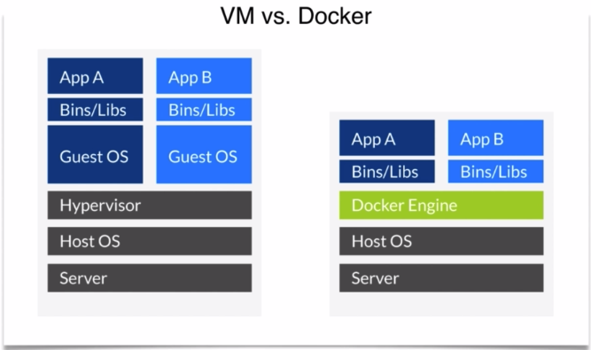
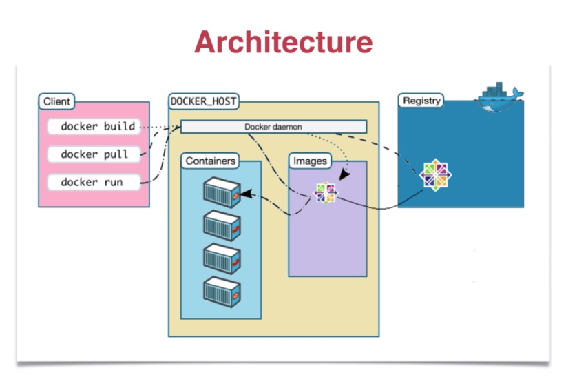
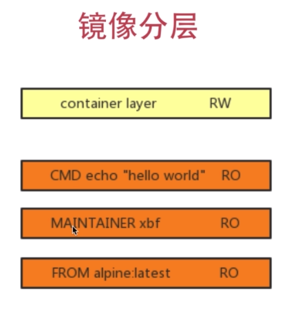
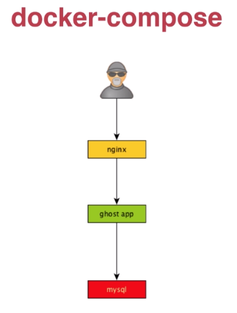

## Docker 笔记

#### 总览
- Docker 简介
- 镜像、容器与仓库
- 持久化容器数据（卷挂载）
- 编排多容器应用
- 网络（待补）

#### 历史

- 2010 dotCloud PAAS
- 2013 Docker 开源
- 2014.6 Docker 1.0
- 2014.7 C 轮 $4000 万
- 2015.4 D 轮 $9500 万
- 至今 Docker 1.13

#### 简介

- 类比
  + 粗糙地理解为轻量级的虚拟机
  + 开挂的 chroot （chroot 对应用程序做了文件系统的分离，和 Docker 有相似支持）
  + 确实不是虚拟机


- 思想
  + 集装箱（弹性伸缩扩展）：双 11 来了，服务器撑不住啦！
  + 标准化：我本地运行没问题啊！
    - 运输方式
    - 存储方式
    - API 接口
  + 隔离：系统好卡，哪个哥们又写死循环了

- 核心词汇
  + Build：镜像（文件系统：应用程序文件+环境文件）
  + Ship：仓库 hub.docker.com, c.163.com
  + Run：容器（本质是一个进程）

- 适用：开发、测试、运维

#### 安装

- docker.com
- 配置 Registry mirrors 加速镜像

```bash
# Mac 安装
open docker*.dmg
docker info

# Linux 下载安装
sudo wget -qO- https://get.docker.com | sh
sudo usermod -aG docker imooc # 允许非 root 用户（imooc）运行 docker，默认 docker 只允许 root 用户执行
```

#### Docker 常用命令



```bash
# 运行
docker run --help

docker run ubuntu echo hello docker
docker run -p 8080:80 -d daocloud.io/nginx
# -P 容器所有端口映射到主机随机的端口
docker run -P -d daocloud.io/nginx

docker exec -it 17add7bbc58c bash

# 停止运行的容器
docker stop 17add7bbc58c

# 获取 image
docker pull

# 创建 image
docker build

# 运行 container
docker run nginx

# 查看镜像 列出本地已有的 image
docker images

# 列出 container ，查找容器的 id ，查看正在运行的程序
docker ps
docker ps -a

# docker cp: 在 host 和 container 之间拷贝文件
docker cp index.html 17add7bbc58c://usr/share/nginx/html

# 保存改动为新的 image
docker commit -m 'fun' 17add7bbc58c nginx-fun

# 删除 image
docker rmi 81a03c984999

# 删除 container
docker rm 17add7bbc58c 32ka49aibyy
```

#### Dockerfile 介绍

##### 第一个 Dockerfile

```
# Dockerfile

# 创建的新镜像，有一个基础镜像
FROM alpine:latest

# 共享的时候告诉其他人这是我写的
MAINTAINER xbf

# 运行容器产生的效果
# 或 CMD ["echo", "hello docker"]
CMD echo 'hello docker'
```

```bash
# 使用 Dockerfile 创建 image

docker build -t hello_docker .
docker images hello_docker
docker run hello_docker
```

##### 第二个 Dockerfile

```
FROM ubuntu
MAINTAINER xbf
RUN sed -i 's/archive.ubuntu.com/mirrors.ustu.edu.cn/g' /etc/apt/sources.list # 使用加速镜像
RUN apt-get update
RUN apt-get install -y nginx
COPY index.html /var/www/html
ENTRYPOINT ["/usr/sbin/nginx", "-g", "daemon off;"]
EXPOSE 80
```

```bash
docker build -t xbf/hello-nginx .
docker run -d -p 80:80 xbf/hello-nginx
curl http://localhost
```

##### 第三个 Dockerfile
- jpress.io

```
FROM hub.c.163.com/library/tomcat
MAINTAINER myname myemail@163.com
COPY jpress.war /usr/local/tomcat/webapps
```

```bash
docker build -t jpress:latest .
docker images
docker run -d -p 8888:8080 jpress
docker ps

docker run -d p 3306:3306 -e MYSQL_ROOT_PASSWORD=000000 -e MYSQL_DATABASE=jpress hub.c.163.com/library/mysql:latest
docker ps
netstat -an|grep 3306
```

- 访问 http://localhost:8888/jpress/

```bash
# 重启 jpress 容器
docker restart 8abk38ed
```

##### Dockerfile 语法

|指令|含义|
|---|---|
|FROM|base image|
|RUN|执行命令|
|ADD|添加文件（可以添加远程文件）|
|COPY|拷贝文件|
|CMD|执行命令|
|EXPOSE|暴露端口|
|WORKDIR|指定路径|
|MAINTAINER|维护者|
|ENV|设定环境变量|
|ENTRYPOINT|容器入口|
|USER|指定用户|
|VOLUME|mount point|

##### 镜像分层

- Dockerfile 中的每一行都产生一个新层。
- 每一层都有一个特定的独立的 id



#### Volume

- 提供独立于容器之外的持久化存储。

```bash
docker run -d --name nginx -v /usr/share/nginx/html nginx
docker inspect nginx # 检查容器信息

# Mac 通过 screen /..../... 进入容器
docker exec -it nginx /bin/bash

docker run -p 80:80 -d -v $PWD/html:/usr/share/nginx/html nginx

# 容器卷（基础镜像为 ubuntu）
docker create -v $PWD/data:/var/mydata --name data_container ubuntu
docker run -it --volumes-from data_container my-app /bin/bash
```


#### Registry 镜像仓库

- 官方 dockerhub 仓库。
- 国内：daocloud 、时速云、aliyun、c.163.com

```bash
# 搜索镜像
docker search whalesay

# 拉取镜像
docker pull whalesay

# 推送镜像
docker push myname/whalesay


# 拉取镜像
docker pull docker/whalesay 

# 运行 docker/whalesay
docker run docker/whalesay cowsay Docker很Cool

docker tag docker/whalesay mengcoder/whalesay

docker images

# 登录远程仓库
docker login

# 推送镜像到远程仓库
docker push mengcoder/whalesay
```

#### docker-compose

##### 安装

- Mac/Windows 上的 docker: 自带
- Linux: 

```bash
curl -L https://github.com/docker/compose/releases/download/1.9.0/docker-compose-$(uname -s)-$(uname -m) > /usr/local/bin/docker-compose
chmod +x ./usr/local/bin/docker-compose
docker-compose --version
```

##### 多容器应用介绍


- 配置文件：docker-compose.yaml
- 常用指令：

|指令|含义|
|---|---|
|build|本地创建镜像|
|command|覆盖缺省命令|
|depends_on|连接容器|
|ports|暴露端口|
|volumes|卷|
|image|pull镜像|


- docker-compose 命令

|命令|用途|
|---|---|
|up|启动服务|
|stop|停止服务|
|rm|删除服务中的各个容器|
|logs|观察各个容器的日志|
|ps|列出服务相关的容器|

##### 多容器应用编排

```bash
mkdir ghost nginx data
cd ghost
vim Dockerfile
vim config.js
```

```
# ghost/Dockerfile

FROM ghost
COPY ./config.js /var/lib/ghost/config.js
EXPOSE 2368
CMD ["npm", "start", "--production"]
```

```javascript
// ghost/config.js

var path = require('path'),
    config;

config = {
  production: {
    url: 'http://mytestblog.com',
    mail: {},
    database: {
      client: 'mysql',
      connection: {
        host: 'db',
        user: 'ghost',
        database: 'ghost',
        port: '3306',
        charset: 'utf8'
      },
      debug: false
    },
    paths: {
      contentPath: path.join(process.env.GHOST_CONTENT, ',')
    },
    server: {
      host: '0.0.0.0',
      port: '2368'
    }
  }
};

module.exports = config;
```

```bash
cd ../nginx
vim Dockerfile
vim nginx.conf
```

```
# nginx/Dockfile

FROM nginx
COPY nginx.conf /etc/nginx/nginx.conf
EXPOSE 80
```

```
# nginx/nginx.conf

worker processes 4;
events {worker connections 1024;}
http {
  server {
    listen 80;
    location / {
      proxy_pass http://ghost-app:2368;
    }
  }
}
```

```bash
cd ../
vim docker-compose.yml
```

```yaml
# docker-compose.yml

version: '2'
networks:
  ghost:
services:
  ghost-app:
    build: ghost
    networkds:
      - ghost
    depends_on:
      - db
     ports:
       - "2368:2368"
  nginx:
    build: nginx
    networks:
      - ghost
    depends_on:
      - ghost-app
    ports:
      - "80:80"
  db:
    images: "mysql:5.7.15"
    networks:
      - ghost
    environment:
      MYSQL_ROOT_PASSWORD: mysqlroot
      MYSQL_USER: ghost
      MYSQL_PASSWORD: ghost
    volumes:
      - $PWD/data:/var/lib/mysql
    ports:
      - "3306:3306"
```

```bash
tree
```

```
  docker-composer.yml
  ghost/
    config.js
    Dockerfile
  nginx/
    Dockerfile
    nginx.conf
  data/
```

```bash
docker-compose stop
docker-compose rm


docker-compose build
docker-composer up -d
```

#### 参考
https://www.imooc.com/learn/867<br />
https://www.imooc.com/learn/824

#### 编辑记录
创建 2019-02-23 23:53:00 周六<br />
编辑 2019-02-25 23:01:00 周一<br />

