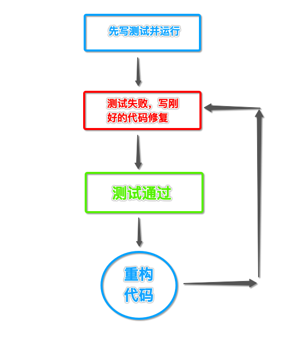

## TDD 笔记

### 测试驱动开发 TDD(Test Driven Development)

#### 是什么

- 一种开发流程
- 理念：以终为始，通过测试出期望的结果来推动开发的进行

#### 有什么用

- 在测试的保护下改善既有的代码设计
- 减少手工直觉测试的遗漏（扩大测试覆盖面）
- 及时反馈

#### 执行步骤



1. 先写测试，并运行测试
2. 测试失败
3. 写刚好的（最少的）代码修复错误，再运行测试
4. 测试通过
5. 重构代码，并运行测试，测试失败
6. 重复 3

#### 例子

##### 先写测试

```go
// 先创建测试用例：$GOPATH/src/tdd/main_test.go

package main

import (
	"testing"
)

func TestAdd(t *testing.T) {

	var actual int
	actual = Add(3, 5)
	expected := 8
	if expected != actual {
		t.Errorf("expected %d, got %d", expected, actual)
	}
}
```

##### 运行测试：测试失败

```sh
go test -v ./
```
```
# 输出结果

# go_test [go_test.test]
./main_test.go:10:11: undefined: Add
FAIL    go_test [build failed]
```

##### 修复：编写必要代码使测试通过
```go
// 编写必要代码
// $GOPATH/src/tdd/main.go

package main

func main() {

}

func Add()  {
	
}
```

```
# 再运行测试
# go_test [go_test.test]
./main_test.go:10:14: too many arguments in call to Add
        have (number, number)
        want ()
./main_test.go:10:14: Add(3, 5) used as value
FAIL    go_test [build failed]
```

```go
// 再编写必要代码
// $GOPATH/src/tdd/main.go

func Add(a, b int) int {
	return 0
}
```

```
# 再运行测试
=== RUN   TestAdd
--- FAIL: TestAdd (0.00s)
    main_test.go:13: expected 8, got 0
FAIL
FAIL    go_test 0.005s
```

```go
// 再编写必要代码
// $GOPATH/src/tdd/main.go

func Add(a, b int) int {
	return 8
}
```

```
=== RUN   TestAdd
--- PASS: TestAdd (0.00s)
PASS
ok      go_test 0.007s
```

##### 重构

```go
// $GOPATH/src/tdd/main_test.go

package main

import (
	"testing"
)

func TestAdd(t *testing.T) {

	t.Run("test func Add: 1", func(t *testing.T) {
		var actual int
		actual = Add(3, 5)
		expected := 8
		if expected != actual {
			t.Errorf("expected %d, got %d", expected, actual)
		}
	})

	t.Run("test func Add: 2", func(t *testing.T) {
		var actual int
		actual = Add(3, 6)
		expected := 9
		if expected != actual {
			t.Errorf("expected %d, got %d", expected, actual)
		}
	})
}
```

```
# 运行测试
=== RUN   TestAdd
=== RUN   TestAdd/test_func_Add:_1
=== RUN   TestAdd/test_func_Add:_2
--- FAIL: TestAdd (0.00s)
    --- PASS: TestAdd/test_func_Add:_1 (0.00s)
    --- FAIL: TestAdd/test_func_Add:_2 (0.00s)
        main_test.go:24: expected 9, got 8
FAIL
FAIL    go_test 0.005s
```

```go
// 再编写必要代码
// $GOPATH/src/tdd/main.go

func Add(a, b int) int {
    if b == 6 {
        return 9
    }
    return 8
}
```

```
# 再测试
=== RUN   TestAdd
=== RUN   TestAdd/test_func_Add:_1
=== RUN   TestAdd/test_func_Add:_2
--- PASS: TestAdd (0.00s)
    --- PASS: TestAdd/test_func_Add:_1 (0.00s)
    --- PASS: TestAdd/test_func_Add:_2 (0.00s)
PASS
ok      go_test 0.006s
```

```go
// 重构
// $GOPATH/src/tdd/main.go

func Add(a, b int) int {
	return a + b
}
```

```
# 测试重构的代码
=== RUN   TestAdd
=== RUN   TestAdd/test_func_Add:_1
=== RUN   TestAdd/test_func_Add:_2
--- PASS: TestAdd (0.00s)
    --- PASS: TestAdd/test_func_Add:_1 (0.00s)
    --- PASS: TestAdd/test_func_Add:_2 (0.00s)
PASS
ok      go_test (cached)  ## 缓存？
```

```
js:tdd chenhao$ go test --count=1 -v ./
=== RUN   TestAdd
=== RUN   TestAdd/test_func_Add:_1
=== RUN   TestAdd/test_func_Add:_2
--- PASS: TestAdd (0.00s)
    --- PASS: TestAdd/test_func_Add:_1 (0.00s)
    --- PASS: TestAdd/test_func_Add:_2 (0.00s)
PASS
ok      go_test 0.006s
```

```go
// 重构测试代码：$GOPATH/src/tdd/main_test.go

func TestAdd(t *testing.T) {

	t.Run("test func Add: 1", func(t *testing.T) {
		var actual int
		actual = Add(3, 5)
		expected := 8

		assertEqual(t, expected, actual)
	})

	t.Run("test func Add: 2", func(t *testing.T) {
		var actual int
		actual = Add(3, 6)
		expected := 9

		assertEqual(t, expected, actual)
	})
}

func assertEqual(t *testing.T, expected, actual int)  {
	t.Helper()

	if expected != actual {
		t.Errorf("expected %d, got %d", expected, actual)
	}
}
```

```
# 运行测试
=== RUN   TestAdd
=== RUN   TestAdd/test_func_Add:_1
=== RUN   TestAdd/test_func_Add:_2
--- PASS: TestAdd (0.00s)
    --- PASS: TestAdd/test_func_Add:_1 (0.00s)
    --- PASS: TestAdd/test_func_Add:_2 (0.00s)
PASS
ok      go_test 0.005s
```

#### 参考

- TDD 百度百科<br/>
https://baike.baidu.com/item/TDD/9064369?fr=aladdin

- 深度解读 - TDD（测试驱动开发）<br/>
https://www.jianshu.com/p/62f16cd4fef3

- 「Live Coding」TDD - Word Frequency<br/>
https://www.bilibili.com/video/av9208705

- 《测试驱动开发--Kent Beck》阅读心得<br/>
https://www.jianshu.com/p/dfa00fe2d40b

- 一个实例搞懂 TDD（测试驱动开发）<br/>
http://blog.51cto.com/2681882/2120480