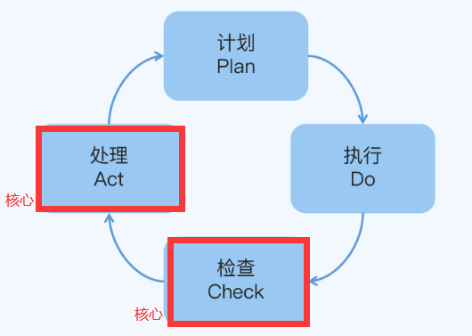
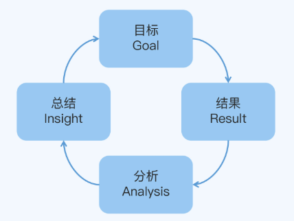
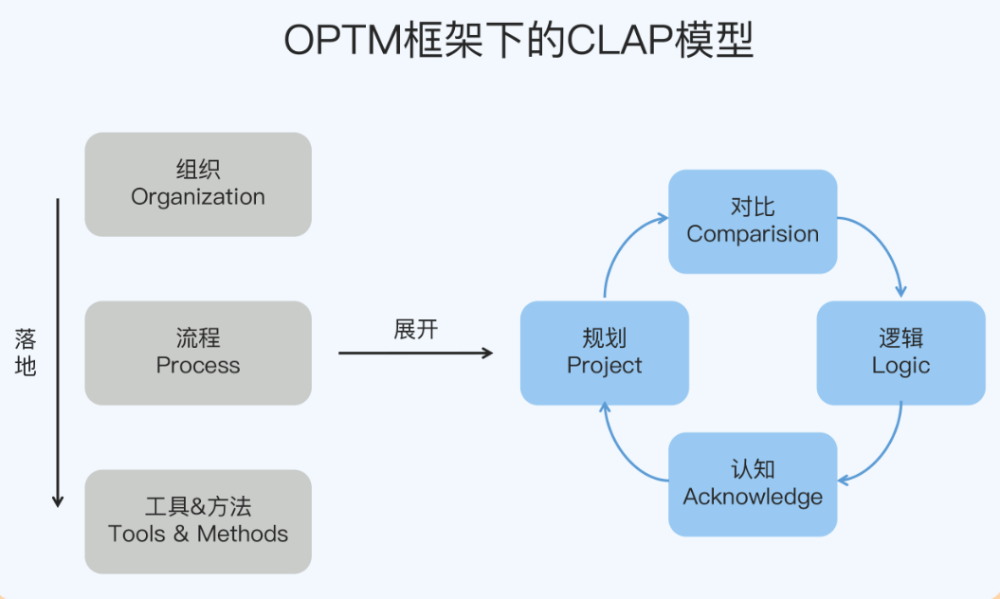
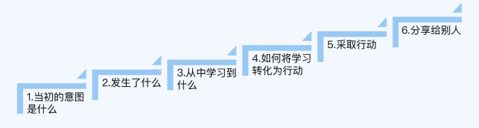
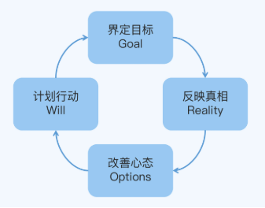
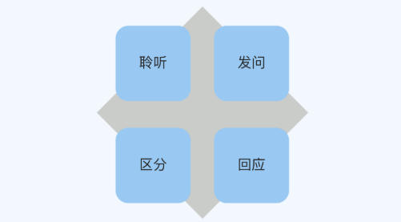
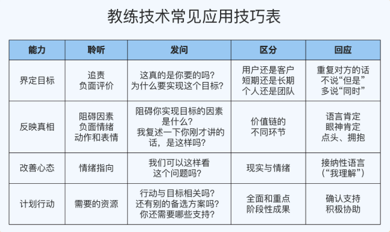
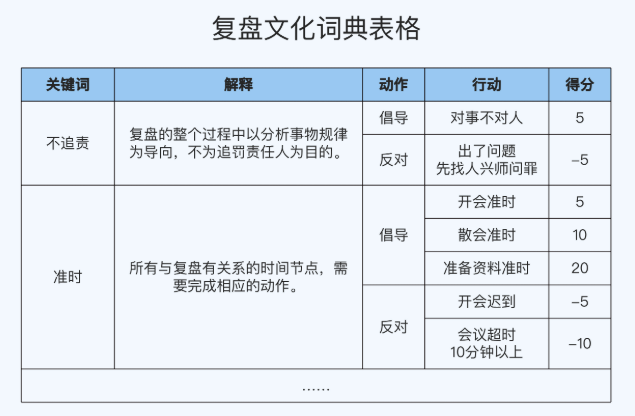

## 复盘技术
[TOC]

> 极客时间《跟高手学复盘》（作者：张鹏）总结

### 复盘的常见问题
1. 复盘变成了甩锅和背锅
复盘不是对过去的追责和惩罚，**而是对未来的优化**（包括对过去事实的总结，更重要的是对原因的分析和对认知的修正）
2. 不知道怎么得到有价值的复盘结论
准确地分析原因和修正认知，需要比较强的洞察力
3. 复盘结论得不到别人支持
让自己的想法得到别人的支持，需要比较强的说服力
虽然总结事实的能力也很重要，但它属于复盘的基本功。对市场的洞察力和对别人的说服力，才是复盘的核心能力，它们最终也将体现为你个人在职场中的影响力，以及你的公司在市场上的竞争力。

### 复盘模型

#### PDCA(Plan-Do-Check-Act)

PDCA 的优化体现在对具体做事标准的修订，比如技术标准、管理制度和财务规范等，常见易错点可整理成 Checklist，行之有效的方法可以固化到流程中。PDCA 每循环一次，做事的标准就验证或优化了一次。

- 具体环节
  + Plan（计划）： 制定目标和计划
  + Do（执行）：展开任务、组织实施
  + Check（检查）：检查过程中的关键节点和最终结果
  + Act（处理）： 
    * 处理检查结果，肯定成功的经验，纳入标准流程
    * 总结失败的教训，引起重视
    * 对于没有解决的问题，提交到下一次 PDCA 循环中去解决

- 局限性

**PDCA 的优化体现在修订具体做事的标准，这也意味着它缺乏对业务战略的调整机制**。

换句话说，PDCA 只会教你实现目标，不会教你调整目标；只会告诉你怎么把事情做好，不会告诉你是不是该做别的事情了

PDCA 模型比较适合工业化时代。工业化时代的特点是市场需求和竞争对手基本上都是确定的，比的是质量、成本和效率等传统核心价值。

但当今社会已逐渐步入后工业时代，又叫 VUCA 时代（Volatility, Uncertainty, Complexity, Ambiguity），一个具体表现就是市场需求靠自己发掘和创造，我们甚至连自己的竞争对手是都谁都不知道。质量、成本和效率这些当然还是很重要，但这方面的能力早已不是决胜能力，而只是必备的基础能力。在这个时代，洞察和满足胜率需求的能力，或者说面向用户创造价值的能力，才是企业的核心竞争力

#### PDF(Preview-Do-FuPan)

**与 PDCA 的区别**：PDCA 是把一件事情分成 4 个环节来做；而 PDF 是把一件事情重复做 3 次，其中第 1 次的沙盘推演和第 3 次的复盘是虚拟地做，只有第 2 次执行是实际地做

- Preivew（沙盘扮演）：在做事之前把所有的可能性推演，找出最佳方案
- Do（执行）：具体的方案落地执行
- FuPan（复盘）：事后对做过的事情进行复盘

运行过程：

1. 目标：当初设定的目标是什么，设定目标的原因是什么

2. 结果：对照目标评估现在的工作成果，是完成了，没有完成，还是部分完成

3. **分析：通过不停地追问，找到成功或失败的根本原因**

   分析原因和总结规律，并且在实际应用中，规律还要经过其他案nnn例验证从而避免偶然性的因素

4. 总结：继续深挖成功的经验或失败的教训

**PDF 的优化体现在对业务战略的调整**，比如销售模式、盈利模式和目标客群等，可以根据行业趋势、竞争策略和用户需求等因素来灵活调整，适应变化

**PDF 模型也有它的局限性**：虽然 PDF 提出了一个很好的思路，但是因为缺乏颗粒度更细的流程和标准，所以它严重依赖复盘者的个人能力，可复制性不强

#### OPTM 框架 - CLAP 模型

##### OPTM 框架

- Organization（组织层）：一支专业的复盘团队，负责组织复盘行动，建设和维护流程、方法和工具，以及分享复盘结论等工作，这是人的层级

  > 复盘团队职责是对重大事件或阶段性任务组织复盘，从而提升认知水平，在业务发展和内部管理等方面帮助公司和员工 成长；具体工作包括推动复盘按部就班地进行，以及完善和优化复盘的流程、工具和方法等

- Process（流程层）：一套标准的复盘流程，包括**会前准备、召开复盘会议和会后执行**三个阶段，具体展示就是 CLAP 模型，这是事的层级

  + 会前准备：也就是对复盘会议的方方面面做细致的筹备安排，包括主题、场地、人员、物料、流程和规则等。其中最主要的工作是三件事：**筹建团队、分配任务和整理资料**
  + 复盘会议：也就是召开会议，会议议程包括**陈述结果、对比目标，梳理逻辑、分析原因，提出假设、修正认知**等，目的是得出复盘结论，从而指导未来的工作
  + 会后执行：也就是让复盘会议落实为真正的成果，包括会议记录同步、资料归档、制定规划、评估效果和实践验证等。其中最主要的工作是两件事，**制定规划和评估效果**

- Tools & Methos（工具 & 方法层）：一系列实用的复盘工具和方法，拿来就能用，保证每个步骤都能顺利落地，这是物的层级

  | 阶段     | 任务     | 工具                           | 方法                                      |
  | -------- | -------- | ------------------------------ | ----------------------------------------- |
  | 综合     | 提问     | 教练技术示意图                 | 教练技术                                  |
  | 会前准备 | 筹建团队 | 岗位画像设计表                 | 选人原则                                  |
  |          | 分配任务 | 角色注意事项汇总表             | 角色定向                                  |
  |          | 整理资料 | 各类流程或数据图表             | MECE 原则                                 |
  | 复盘会议 | 组织会议 | 里程碑挂图                     | 议政厅会议法                              |
  |          | 对比目标 | 快速对比表格                   | SCQA 框架 TECCA 原则 SMART 原则 |
  |          | 梳理逻辑 | 逻辑树、矩阵图、流程图、关系图 | 归纳法、演绎法、三段论、五问法            |
  |          | 修正认知 | CLD 模型                       | 假设验证法                                |
  | 会后执行 | 制定规划 | OKR 分解表、甘特图             | OKR                                       |
  |          | 评估效果 | 检视问题表                     | Double Check                              |

##### CLAP 模型

CLAP 模型不但能优化做事细节，也能优化业务战略，从而弥补了 PDCA 模型的局限性

- Comparision（对比）：陈述结果，和最初设定的目标进行对比，也就是对事实的总结
- Logic（逻辑）：梳理逻辑，解释结果和目标之间的差距，也就是对原因的分析
- Acknowledge（认知）：提出假设，更新对业务和用户的理解，也就是对认知的修正
- Project（规划）：制定改进规划，在实践中验证，也就是对未来的优化。得到的结果，又可以作为下一次循环的依据。

CLAP 模型有了 OPTM 的框架加持，实际应用时的颗粒度就更细了，可复制性大大提高，非核心高层的普通人也可以用出效果，互相赋能，从而弥补了 PDF 模型的局限性

##### AAR(After Action Review): 4W2H

- Who 参与者都有谁？主要角色包括：组织者、评论者、参与者

- What 讨论什么？关键事件

- When 何时？一般而言，最好马上开始

- Where 何地？离现场越近越好

- How long 需要多长时间？一般 15 分钟~1 个小时

- How to do 怎么做？一般包括 6 个步骤

  

#### 教练技术

教练的追求并不是让学员因为不那么精湛的技术而感到羞愧，而是帮助学员提升表现，这种帮助具体可以分为两个方面：消除障碍和激发潜能

这恰恰就是教练技术适合用来做复盘的原因，因为复盘的目的优化，复盘团队的追求就是帮助团队和个人学习成长，从而拥有解决问题的能力

##### 应用步骤：GROW 模型

1. Goal（界定目标）：放下情绪冲突的意气之争，聚集于真正的目标探讨
2. Reality（反映真相）：Reality 本意是“事实”，这里我说的是“真相”，因为我想强调要从行为的表象中意识到心态的本质
3. Options（改善心态）：Option 本意是“选项”，这里我说的是“心态”，因为我想强调不但要关注方案上的选择，更要关注心理上的选择
4. Will（计划行动）：积极地制定行动计划，跨越障碍，解决问题，达成目标

##### 四种基本能力

1. 聆听：通过聆听发现对方可能存在的问题，如从一开始的对话中听出 A 主管的情绪变化是因为担心自己不被认可
2. 发问：通过提问让对方袒露出真实的想法，如通过问 A 主管有没有亲自去一线上课的问题时，找出其心结
3. 区分：通过区分帮对方卸下心理上的负担，如对上课、做课和卖课的能力，帮 A 主管重拾信心
4. 回应：通过回应及时给予对方有力的支持，如对 A 主管的拥抱、鼓励和调侃，帮她恢复到更加积极的心态

##### 常见应用技巧

### 复盘流程
#### 会前准备
##### 制度和文化：怎么营造复盘环境？

- 制度层面

  + 中高层管理者：效率

  + 小团队 Leader：可控性

    * 优先级
    * 奖惩措施

    

  + 新人：学习成本

    * 书面文档
    * 辅导机制

- 文化层面
  + 是什么（What）
  + 为什么（Why）
  + 怎么做（How）

##### 三角法：怎么打造复盘团队？

##### MECE 法则：怎么准确复盘资料？

#### 复盘会议

1）五步法：如何召开一次高效的复盘会议？

2）事实比较：如何快速比较目标与结果？

3）逻辑分析：分析原因中的注意点都有哪些？

4）假设审视：总结规律，怎么才能给归因做好减法？

#### 会后执行

1）OKRAP：怎样根据复盘结果制定计划？

2）Double Check：怎么评估一次复盘的效果？

### 实战案例
