### 高可用架构类问题
常见问题

1. MySQL 的主从复制是如何工作的
2. 比较一下基于 GTID 方式的复制和基于日志点的复制。
3. 比较一下 MMM 和 MHA 两种高可用架构的优缺点
4. 如何减小主从复制的延迟
5. 说说你对 MGR 的认识
6. 如何解决数据库读/写负载大的问题？

- MySQL的主从复制是如何工作的？
  知识点

  + MySQL主从复制的实现原理

    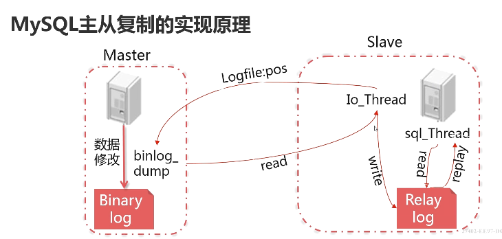

    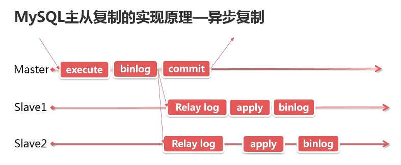

    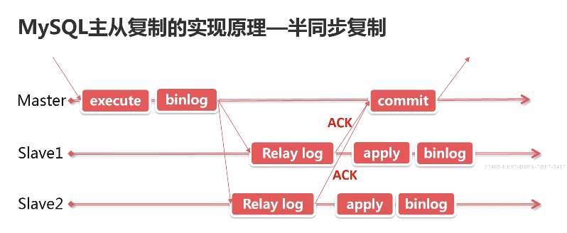

  + MySQL主从复制的配置步骤

    在MASTER服务器上的操作

    1. 开启binlog（必须）开启 gtid（可选）
    2. 建立同步所用的数据库账号
    3. 使用 master_data 参数备份数据库
    4. 把备份文件转输到 Slave 服务器

    在Slave服务器上的操作

    1. 开启binlog（可选）开启gtid（可选）
    2. 恢复 Master 上的备份数据库
    3. 使用 Change master 配置链路
    4. 使用 start slave 启动复制

    ```sh
    # mysql-01: 192.168.1.91
    # mysql-02: 192.168.1.92
    
    # mysql-02
    mysql> select @@version;
    8.0.11
    
    # mysql-01
    mysql> select @@version;
    8.0.11
    
    mysql> show variables like 'log_bin%'; 
    variable_name value 
    log_bin       ON
    log_bin_basename  /home/mysql/sql_log/mysql-bin
    1oq_bin_index     /home/mysql/sql_1og/mysq1-bin.index
    loq_bin_trust_function_creators OFF
    log_bin_use_v1row_events        OFF
    
    mysql> show variables like 'gtid_mode';
    variable_name  value
    gtid_mode      ON
    
    $ more /etc/my.cnf
    ...
    default_authentication_plugin='mysql_native_password'
    ...
    # Replice
    server-id = 9001
    relay_log = mysqld-relay-bin
    gtid_mode = on
    enforce-gtid-consistency
    log-slave-updates = on
    master_info_repository = TABLE
    relay_log_info_repository = TABLE
    
    mysql> create user repl@'192.168.1.%' identified by '123456';
    mysql> grant replication slave on *.* to repl@'192.168.1.%';
    mysql> select * from stock.stock where id = 1;
    id   product_id  category_id  warehouse_id  count  modified_time
    1    2030        9            1             10     2018-08-31 09:51:22
    
    # 备份（master-data=2 备份日志点）
    $ mysqldump --single-transaction -uroot -p --routines --triggers --events --master-data=2 --all-databases > master.sql
    $ less master.sql
    --  MysQL dump 10.13 Distrib 8.0.11，for Linux（x86 64）
    -- Host：localhost Database：
    -- Server versior 8.0.11
    ... ...
    -- GTID state at the beginning of the backup
    -- SET@@GLOBAL.GTID_PURGED-/*80000'+'*/'17d353ea-7d31-11e8-9ee5-e660752e2844：1-12，
    -- Position to start replication or point-in-time recovery from
    -- CHANGE MASTER TO MASTER-LOG-FILE-' mysql-bin. 000012', MASTER LOG_Pos=710;
    -- current Database: mysal
    
    $ scp master.sql root@192.168.1.92:/root
    
    # mysql-02
    $ ls
    master.sql
    $ mysql -uroot -p < master.sql # 初始化数据库
    mysql> change master to master_host='192.168.1.91', master_log_file='mysql-bin.000012', MASTER_LOG_POS=710; # 基于日志点的复制
    mysql> show slave status\G
    mysql> start slave user='repl' password='123456';
    mysql> show slave status\G
    Slave_IO_Running:  Yes
    Slave_SQL_Running: Yes
    
    
    
    
    
    ### 半同步复制 ###
    # https://www.cnblogs.com/ivictor/p/5735580.html
    # mysql-01
    mysql> show plugins;
    mysql> INSTALL PLUGIN rpl_semi_sync_master SONAME 'semisync_master.so';
    mysql> show plugins;
    mysql> show variables like 'rpl%';
    mysql> set persist rpl_semi_sync_master_timemout=500;
    mysql> set persist rpl_semi_sync_master_enabled=ON;
    
    # mysql-02
    mysql> INSTALL PLUGIN rpl_semi_sync_slave SONAME 'semisync_slave.so';
    mysql> show plugins;
    mysql> show variables like 'rpl%';
    mysql> set persist rpl_semi_sync_slave_enabled=ON;
    mysql> stop slave io_thread;
    mysql> start slave io_thread user='repl' password='123456';
    mysql> show slave status\G
    mysql> show global status like 'rpl%';
    Rpl_semi_sync_master_status   ON
    
    # mysql-01
    mysql> show global status like 'rpl%';
    Rpl_semi_sync_master_status   ON
    mysql> show variables like 'rpl%';
    mysql> update stock.stock set count=30 where id = 1; # 很快就返回
    
    mysql> set persist rpl_semi_sync_master_timeout=10000; # 测试超时
    
    
    # mysql-02
    mysql> stop slave io_thread; # 取消从库的 IO 进程
    
    # mysql-01
    mysql> update stock.stock set count=40 where id = 1; # 执行时间非常长
    
    ```

- 比较 GTID 复制和基于日志点的复制

  知识点

  + 什么是基于日志点的复制

    传统的主从复制方式

    Slave 请求 Master 的增量日志依赖于日志偏移量

    配置链路时需指定 master_log_file 和 master_log_pos 参数

  + 什么是基于 GTID 的复制

    GTID = source_id:transaction_id

    Slave 增量同步 Master 的数据依赖于其未同步的事务 ID

    配置复制链路时，Slave 可以根据已经同步的事务 ID 继续自动同步 

  + 这两种复制方式各自的特点

    | 基于日志的复制               | 基于GTID的复制                                      |
    | ---------------------------- | --------------------------------------------------- |
    | 兼容性好                     | 同老版本MySQL及MariaDB不兼容                        |
    | 支持MMM和MHA架构             | 仅支持MHA架构                                       |
    | 主备切换后很难找到新的同步点 | 基于事务ID复制，可以很方便的找到未完成同步的事务 ID |
    | 可以方便的跳过复制错误       | 只能通过置入空事务的方式跳过错误                    |

    两种复制方式如可选择

    + 需要兼容老版本MySQL及MariaDB
    + 基于日志点的复制
    + 需要使用MMM架构
    + 基于日志点的复制
    + 其它各种情况
    + 优先选择基于GTID的复制

- 比较一下MMM和MHA两种高可用复制架构
  知识点

  + MMM和MHA两种架构的作用

    对主从复制集群中的MASTER的健康进行监控
    当MASTER宕机后把写VIP迁移到新的MASTER
    重新配置集群中的其它Slave对新的MASTER同步

  + MMM架构的优缺点及适用场景

    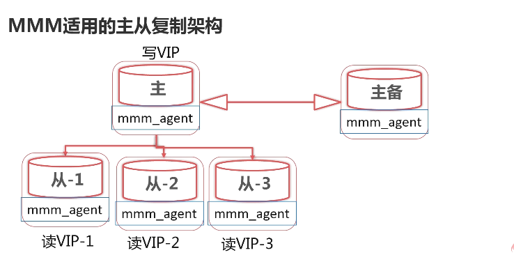

    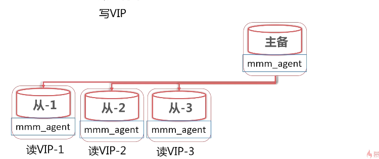

    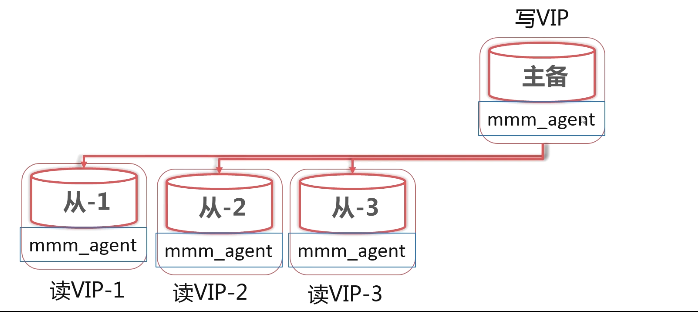

    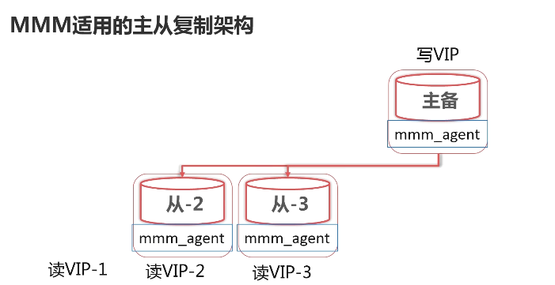

    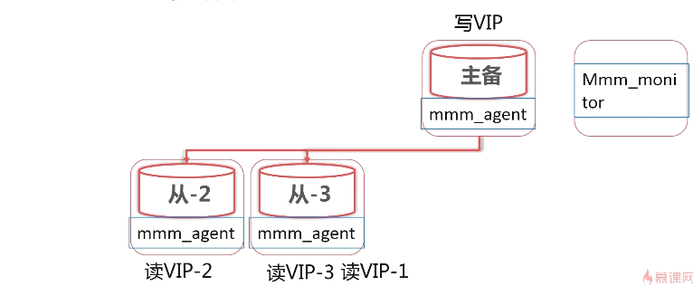

    **MMM 架构的故障转移步骤**

    SLAVE服务器上的操作

    + 完成原主上已复制日志的恢复
    + 使用Change Master命令配置新主

    主备服务器上的操作

    + 设置read only=off

    + 迁移写VIP到新主服务器

      | 资源     | 数量 | 说明                                                         |
      | -------- | ---- | ------------------------------------------------------------ |
      | 主 DB    | 2    | 用于主备模式的主主复制配置                                   |
      | 从 DB    | 0~N  | 可以配置0台或多台从服务器                                    |
      | IP 地址  | 2n+1 | N为MySQL服务器的数量                                         |
      | 监控用户 | 1    | 用于监控数据库状态的MySQL用户（replication client）          |
      | 代理用户 | 1    | 用于MMM的agent端用于改变read_only状态<br/>（super，replication client，process） |
      | 复制用户 | 1    | 用于配置MySQL复制的MySQL用户（replication slave）            |

- MMM 架构的配置步骤
  + 配置主主复制的集群架构
  + 安装Centos的YUM扩展包
  + 安装所需的Perl支持包
  + 安装MMM工具包
  + 配置并启用MMM服务
- MMM架构的优点
  + 提供了读写VIP的配置，使读写请求都可以达到高可用。
  + 工具包相对完善，不需要额外开发脚本。
  + 完成故障转移后，可以持续对MySQL集群进行高可用监控

- MMM架构的缺点
  + 故障切换简单粗暴易丢事务
  + 主备使用5.7以后的半同步复制
  + 不支持GTID的复制方式
  + 社区不活越，很久未更新版本
  + 自行修改perl脚本实现

- MMM架构的适用场景

  + 使用基于日志点的主从复制方式

  + 使用主主复制的架构

  + 需要考虑读高可用的场景

    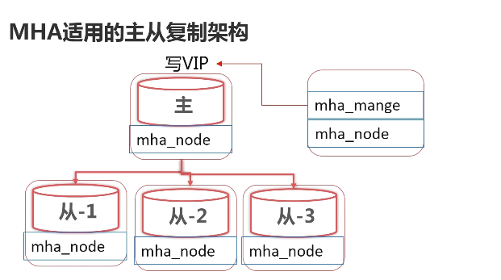

    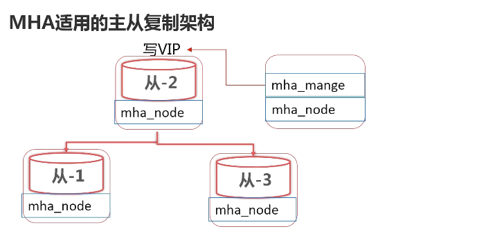

- MHA  架构的故障转移步骤
  + 选举具有最新更新的Slave
  + 尝试从宕机的master保存二进制日志
  + 应用差异的中继日志到其它Slave
  + 应用从Master保存的二进制日志
  + 提升选举的Slave为新的Master
  + 配置其它Slave向新的Master同步

- MHA 架构的需要的资源

  | 资源     | 数量 | 说明                                              |
  | -------- | ---- | ------------------------------------------------- |
  | 主 DB    | 1    | 用于初始主从复制的Master服务器                    |
  | 从 DB    | 2~N  | 可以配置2台或多台从服务器                         |
  | IP 地址  | n+2  | N为MySQL服务器的数量                              |
  | 监控用户 | 1    | 用于监控数据库状态的MySQL用户（all privileges）   |
  | 复制用户 | 1    | 用于配置MySQL复制的MySQL用户（replication slave） |

- MHA 架构的配置步骤

  + 配置一主多从的复制架构
  + 安装CentOS的Yum扩展源及依赖包
  + 配置集群内各主机的SSH免认证
  + 在各节点安装mha_node软件
  + 在管理节点安装mha_manager
  + 配置并启动MHA管理进程

  ```sh
  # mysql-01: 192.168.1.91
  # mysql-02: 192.168.1.92
  # mysql-03: 192.168.1.93
  
  # mysql-01
  mysql> show slave hosts:
  server_id Host Port  Master_id  Slave_UUID
  9002           3306  9001       9a94313f-ad7c-11e8-989b-080027e24cof
  9003           3306  9001       207dbe49-ad7d-11e8-8e47-0800275e4498
  $ systemctl status firewalld
  inactive
  $ more /etc/hosts
  192.168.1.91 mysql-01
  192.168.1.92 mysql-02
  192.168.1.93 mysql-03
  $ grep auth /etc/my.cnf
  default_authentication_plugin='mysql_native_password'
  $ ssh-keygen
  $ ssh-copy-id -i /root/.ssh/id_rsa root@192.168.1.91
  $ ssh-copy-id -i /root/.ssh/id_rsa root@192.168.1.92
  $ ssh-copy-id -i /root/.ssh/id_rsa root@192.168.1.93
  
  # mysql-02
  $ ssh-keygen
  $ ssh-copy-id -i /root/.ssh/id_rsa root@192.168.1.91
  $ ssh-copy-id -i /root/.ssh/id_rsa root@192.168.1.92
  $ ssh-copy-id -i /root/.ssh/id_rsa root@192.168.1.93
  
  # mysql-03
  $ ssh-keygen
  $ ssh-copy-id -i /root/.ssh/id_rsa root@192.168.1.91
  $ ssh-copy-id -i /root/.ssh/id_rsa root@192.168.1.92
  $ ssh-copy-id -i /root/.ssh/id_rsa root@192.168.1.93
  
  
  # mysql-01, mysql-02, mysql-03
  $ yum install -y perl-DBD-MySQL ncftp perl-DBI.x86
  $ rpm -ivh mha4mysql-node-0.57-0.e17.noarch.rpm
  
  # 监控节点（如 mysql-03）
  $ yum -y install perl-Config-Tiny.noarch perl-Time-HiRes.x84_64 perl-Paralel-ForkManager perl-Log-Dispatch-Perl.noarch
  $ yum -y mha4mysql-manager-0.57-0.el7.noarch.rpm
  ```

- MHA 架构的优点
  + 支持 GTID 的复制方式和基于日志点的复制方式
  + 可从多个 Slave 中选举最适合的新 Master
  + 会尝试从旧 Master 中尽可能多的保存未同步日志

- MHA 架构的缺点
  + 未必能获取到旧主未同步的日志
  + 主备使用 5.7 以后的半同步复制
  + 需要自行开发写 VIP 转移脚本
  + 只监控 Master 而没有对 Slave 实现高可用的办法

- MHA 架构的适用场景
  + 使用基于 GTID 的复制方式
  + 使用一主多从的复制架构
  + 希望更少的数据丢失的场景


- 如何减少主从复制延迟

  知识点

  + 主从复制延迟产生的原因

    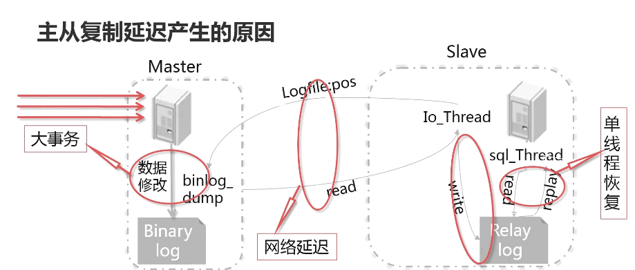

  + 几种减少主从延迟的处理方法

    大事务：数万行的数据更新以及对大表的DDL操作

    化大事务为小事务，分批更新数据。
    使用pt-online-schema-change工具进行DDL操作。

    网络延迟
    减小单次事务处理的数据量以减少产生的日志文件大小。
    减少主上所同步的Slave的数量。

    由主上多线程的写入从上单线程恢复引起的延迟

    使用MySQL5.7之后的多线程复制

    使用MGR复制架构。

- 说说你对 MGR 复制的理解

  知识点

  + 什么是 MGR 复制？

    MGR（MySQL Group Replication）
    是官方推出的一种基于Paxos协议的复制。
    是一种不同于异步复制的多Master复制集群。

    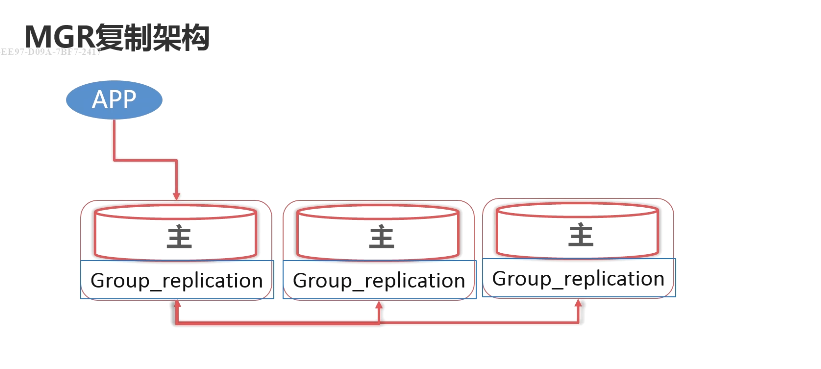

    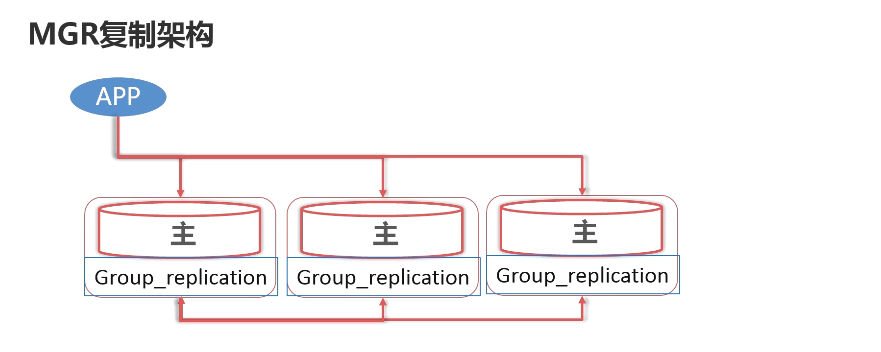

    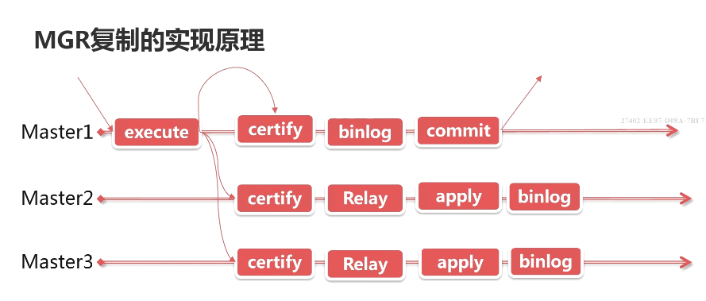

    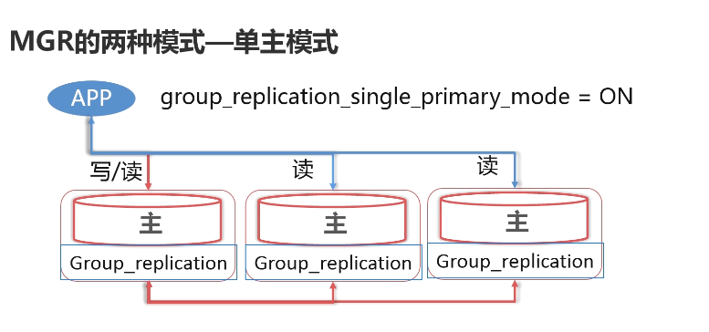

    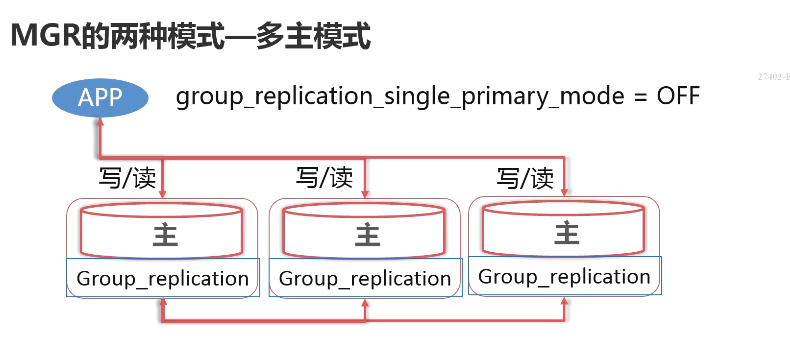

    | 集群大小 | 投票数 | 允许宕机数量 |
    | -------- | ------ | ------------ |
    | 3        | 2      | 1            |
    | 4        | 3      | 1            |
    | 5        | 3      | 2            |
    | 6        | 4      | 2            |
    | 7        | 4      | 3            |
    | 8        | 5      | 3            |
    | 9        | 5      | 4            |

  + 如何使用 MGR 复制

    MGR 复制架构的配置步骤

    + 安装group-replication插件
    + 在第一个实列上建立复制用户
    + 配置第一个组实例
    + 把其它实例加入组

  + 当前 MGR 的优缺点

    优点
    Group Replication组内成员间基本无延迟。
    可以支持多写操作，读写服务高可用

    数据强一致，可以保证不丢失事务。

    缺点

    只支持InnoDB存储引擎的表，并且每个表上必须有一个主键

    单主模式下很难确认下一个PRIMARY
    只能用在gtid模式的复制形式下，且日志格式必需为row

  - MGR复制架构的适用场景
    + 对主从延迟十分敏感的应用场景。
    + 希望可以对读写提供高可用的场景。
    + 希望可以保证数据强一致的场景。

  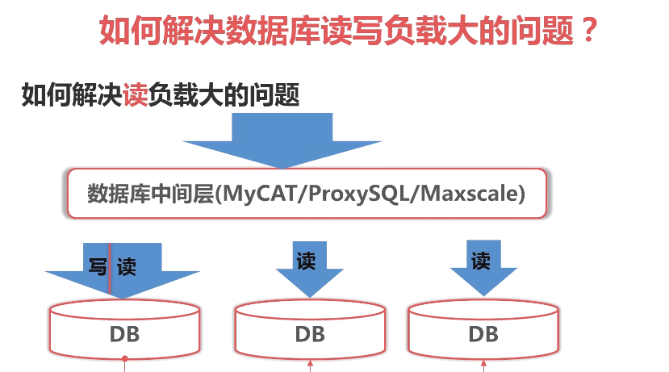

  为原DB增加Slave服务器

  进行读写分离，把读分担到Slave

  增加数据库中间层，进行负载均衡

  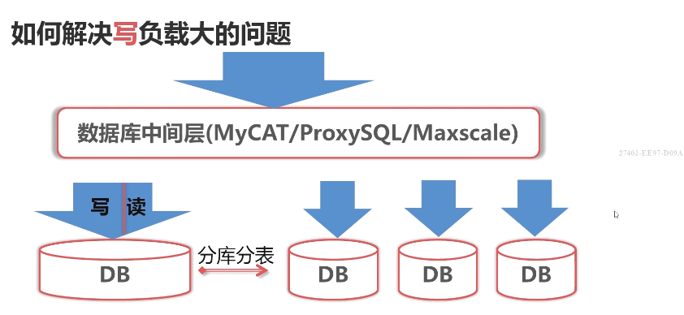

