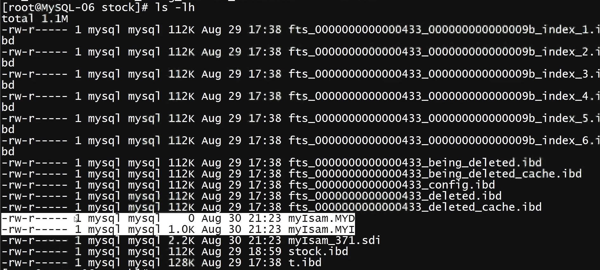
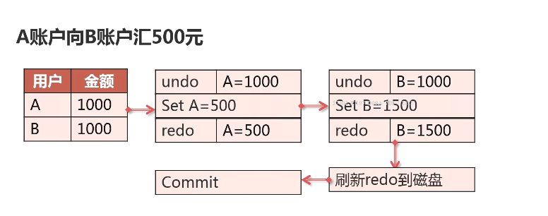
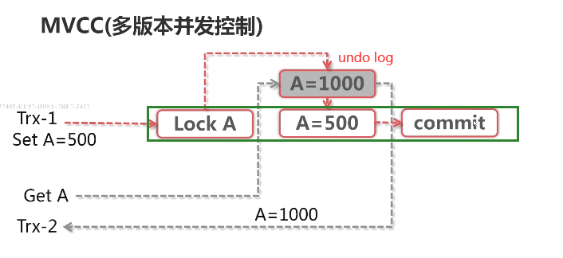

### 存储引擎类问题

1. 说一说你了解的MySQL存储引擎及其适用场景

2. 在什么情况下Innodb无法在线修改表结构？

3. 在无法进行在线修改表结构的情况下，要如何操作？
4. InnoDB是如何实现事务的？
5. Innodb读操作是否会阻塞写操作？

- 常用的MySQL存储引擎及使用场景

  知识点

  + MySQL常用的存储引擎

    | 引擎名称 | 事务 | 说明                                               |
    | -------- | ---- | -------------------------------------------------- |
    | MYISAM   | N    | MySQL5.6之前的默认引擎，最常用的非事务型存储引擎   |
    | CSV      | N    | 以CSV格式存储的非事务型存储引擎                    |
    | Archive  | N    | 只允许查询和新增数据而不允许修改的非事务型存储引擎 |
    | Memory   | N    | 是一种易失性非事务型存储引擎                       |
    | INNODB   | Y    | 最常用的事务型存储引擎                             |
    | NDB      | Y    | MySQL集群所使用的内存型事务存储引擎                |

    * MyISAM 的特点

      1. 非事务型存储引擎

      2. 以堆表方式存储

      3. 使用表级锁

      4. 支持Btree索引，空间索引，全文索引

      ```sh
      mysql> use stock;
      mysql> create table myIsam(id int, c1 varchar(10)) engine=myisam;
      mysql> check table myIsam;
      ----------------------------------------
      |Table       |Op     |Msg_Type|Msg_text|
      |stock.myIsam|check  |status  |OK      |
      ----------------------------------------
      mysql> repair table myIsam;
      ----------------------------------------
      |Table       |Op     |Msg_Type|Msg_text|
      |stock.myIsam|repair |status  |OK      |
      ----------------------------------------
      ```

      

      ```sh
      $ myisampack --help # 可对 myisam 表压缩
      $ myisampack -b -f myIsam
      Compressing myIsam. MYD: (0 records)
      Calculating statistics
      -Compressing file 
      Empty file saved in compressed format
      $ ls -lh myIsam*
      -rw-r----- 1 mysql mysql 50   Aug 30 21:33 myIsam. MYD
      -rw-r----- 1 mysql mysql 1.0K Aug 30 21:33 myIsam. MYT
      -rw-r------1 mysql mysql 0    Aug 30 21:33 myIsam.OLD
      -rw-r----- 1 mysql mysql 2.2K Aug 30 21:33 myIsam_373.sdi
      ```

      适用场景

      * 读操作远远大于写操作的场景
      * 不需要使用事务的场景

    * CSV 引擎的特点

      1. 非事务型存储引擎
      2. 数据以CSV格式存储
      3. 所有列都不能为NULL
      4. 不支持索引

      ```sh
      mysql> create table mycsv(id int, c1 varchar(20),c2 char (20)) engine=csv;
      ERROR 1178 (42000): The storage engine for the table doesn't support nuilable columns
      mysql> create tabie mycsv(id int not null,c1 varchar(20) not nul1 ,c2 char(20) not null) engine=csV;
      Query ok, o rows affected (0.02 sec)
      mysql> insert into mycsv values(1，'aa'，'bb'),(2，'cc'，'dd');
      
      
      [root@MysQL-06 stock]# 1s-1h mycsv*
      -rw-r-- 1 mysql mysql 35   Aug 30 21:43 mycsv.CSM
      -rw-r-- 1 mysql mysql 24   Aug 30 21:43 mycsv.CSV
      -rw-r-- 1 mysql mysql 3.OK Aug 30 21:42 mycsv_375.sdi
      [root@MysQL-06 stock] # more mycsv.CSV
      1,"aa", "bb"
      2, "cc","dd"
      [root@MysQL-06 stock] # echo '3,"dd","ee"' >> mycsv.CSV
      [root@MysQL-06 stock] # more mycsv.CSV
      1,"aa","bb"
      2,"cc","dd"
      3,"dd","ee"
      mysql> select * from mycsv;
      |----|----|----|
      | id | c1 | c2 |
      | 1  | aa | bb |
      | 2  | cc | do |
      | 3  | dd | ee |
      |----|----|----|
      3 rows in set (0.00 sec)
      mysql> create index idx_id on mycsv(id)
      ERROR 1069 (42000): Too many keys specified; max o keys allowed
      ```

      适用场景

      * 做为数据交换的中间表使用

    + Archive 引擎的特点

      1. 非事务型存储引擎
      2. 表数据使用zlib压缩
      3. 只支持Insert和Select
      4. 只允许在自增ID上建立索引

      ```sh
      mysql> create table myarchive(id int auto_increment not null,c1 varchar(20), c2 char(20),key (id))engine=archive;
      ```

      

      ```sh
      mysql> insert into myarchive(c1, c2) values('aa', 'bb').('cc', 'dd');
      mysql> delete from myarchive where id = 1;
      ERROR 1031 (HY000): Table storage engine for 'myarchive' doesn't have this option
      mysql> updąte myarchive set c1='ddd' where id=1;
      ERROR 1031 (HYO00): Table storage engine for ' myarchive' doesn't have this option
      mysql> create index idx_cl on myarchive(c1); 
      ERROR 1069 (42000): Too many keys specified; max 1 keys allowed
      ```

      适用场景

      * 日志和数据采集类应用
      * 数据归档存储

    + Memory 引擎的特点

      1. 非事务型存储引擎
      2. 数据保存在内存中
      3. 所有字段长度固定
      4. 支持 Btree 和 Hash 索引

      适用场景

      * 用于缓存字典映射表
      * 缓存周期性分析数据

    + Innodb 引擎的特点

      1. 事务型存储引擎支持ACID
      2. 数据按主键聚集存储
      3. 支持行级锁及MVCC
      4. 支持Btree和自适应Hash索引
      5. 支持全文和空间索引

      适用场景：大多数 OLTP 场景

    + NDB 引擎的特点

      1. 事务型存储引擎
      2. 数据存储在内存中
      3. 支持行级锁
      4. 支持高可用集群
      5. 支持Ttree索引

      适用场景：需要数据完全同步的高可用场景

  + 在什么情况下INNODB无法在线修改表
    知识点

    + Innodb不支持在线修改表结构的场景

      | 操作       | 语法                                                         |
      | ---------- | ------------------------------------------------------------ |
      | 加全文索引 | CREATE FULLTEXT INDEX name ON table(column);                 |
      | 加空间索引 | ALTER TABLE geom ADD SPATIAL INDEX(g)                        |
      | 删除主键   | ALTER TABLE tbl name DROP PRIMARY KEY                        |
      | 增加自增列 | alter table t add column id int auto increment not null primary key |
      | 修改列类型 | ALTER TABLE tbl name CHANGE c1 c1 NEW TYPE                   |
      | 改表字符集 | ALTER TABLE tbl name CHARACTER SET = charset name            |

      * 在线 DDL 存在的问题

        有部分语句不支持在线DDL
        长时间的DDL操作会引起严重的主从延迟
        无法对DDL操作进行资源限制

      * 如何更安全的执行DDL？

        pt-online-schema-change[OPTIONS]DSN

        ```sh
        mysql> alter table stock add column modified_time timestamp\c
        
        $ pt-online-schema-change --alter "add column modified_time timestamp" --execute D=stock,t=stock,u=dba,p=123456
        ```

    + Innodb 是如何实现事务？

      知识点

      + 什么是事务？

        | 特征        | 说明                                                         |
        | ----------- | ------------------------------------------------------------ |
        | 原子性（A） | 一个事务中的所有操作，要么全部完成，要么全部不完成，不会结束在中间某个环节。 |
        | 一致性（C） | 在事务开始之前和事务结束以后，数据库的完整性没有被破坏。     |
        | 隔离性（I） | 事务的隔离性要求每个读写事务的对象与其它事务的操作对象能相互分离，即该事务提交前对其它事务都不可见。 |
        | 持久性（D） | 事务一旦提交了，其结果就是永久性的，就算发生了宕机等事故数据库也能将数据恢复。 |
    
        事务实现方式
    
        | 特征        | Innodb 实现方式                                |
        | ----------- | ---------------------------------------------- |
        | 原子性（A） | 回滚日志（Undo log）：用于记录数据修改前的状态 |
        | 一致性（C） | 重作日志（Redo Log）：用于记录数据修改后的状态 |
        | 隔离性（I） | 锁：用于资源隔离，分为共享锁和排它锁           |
        | 持久性（D） | 重作日志（Redo log）+回滚日志（Undo Log）      |
    
        
    
      + Redo log 和 undo log 在事务实现中的作用
    
      + Innodb 读是否会阻塞写？
    
        读写应该相互阻塞吗？
    
        + 查询需要对资源加共享锁（S）
    
        + 数据修改需要对资源加排它锁（x）
    
          |        | 排它锁 | 共享锁 |
          | ------ | ------ | ------ |
          | 排它锁 | 不兼容 | 不兼容 |
          | 共享锁 | 不兼容 | 兼容   |
    
          ```sh
          # session-1
          mysql> begin;
          mysql> select * from stock.stock where id = 1;
          id   product_id  category_id  warehouse_id  count  modified_time
          1    2030        9            1             10     2018-08-31 09:51:22
          
          # session-2
          mysql> begin;
          mysql> update stock.stock set count=30 where id = 1;
          
          # session-1
          mysql> select * from stock.stock where id = 1; # 查询没有被阻塞
          id   product_id  category_id  warehouse_id  count  modified_time
          1    2030        9            1             10     2018-08-31 09:51:22
          ```
    
          知识点：InnoDB MVCC 的实现方式
    
          
    
    + 如何更安全的在线修改表结构
    
  + 各种常见存储引擎的使用场景
