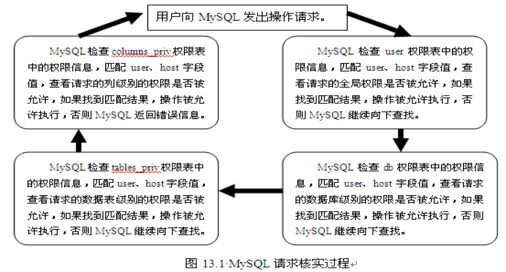
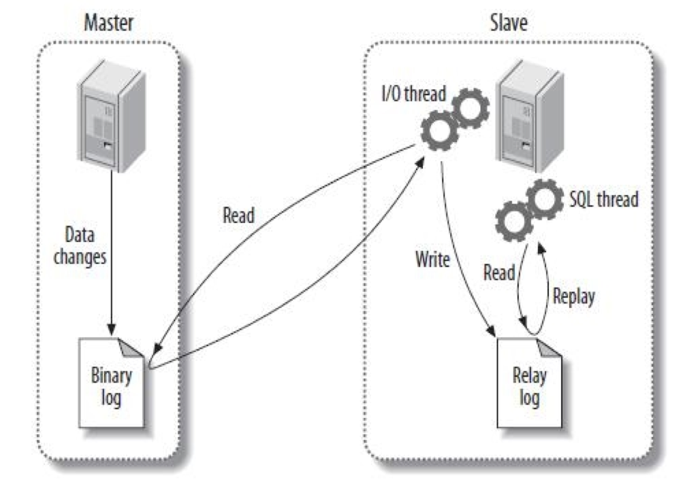

### MySQL 笔记 1

#### SQL
- DDL
- DML
- DQL
- DCL

#### 数据库存储引擎
- InnoDB
- MyISAM
- Memory
- Merge
- Archive
- Federated
- CSV
- BlackHole

#### DDL
```sql
# 创建数据库
CREATE DATABASE <库名>;
# 删除数据库
DROP DATABASE <库名>;
# 查看数据库
SHOW DATABASES;
# 查看表
SHOW TABLES;


# 创建表
CREATE TABLE <表名>
(
   <列名1>, <数据类型> [列级别约束条件] [默认值] [注释],
   <列名1>, <数据类型> [列级别约束条件] [默认值] [注释],
   ... ...
   [表级别约束条件]
);

/*
主键约束
  单字段主键：字段名 数据类型 PRIMARY KEY [默认值]
  多字段联合主键：PRIMARY KEY [字段1, 字段2, ..., 字段n]
*/

/*
外键约束
  [CONSTRAINT <外键名>] FOREIGN KEY 列名1 [,列名2, ...]
  REFERENCES <主表名> 主键列1 [,主键列2, ...]
*/

/*
非空约束
  字段名 数据类型 NOT NULL
*/

/*
唯一性约束
  字段名 数据类型 UNIQUE
*/

/*
默认约束
  字段名 数据类型 DEFAULT 默认值
*/

/*
自增属性
  字段名 数据类型 AUTO_INCREMENT
*/

# 查看表结构
DESCRIBE <表名>;
DESC <表名>;
SHOW CREATE TABLE <表名>;

# 修改表结构
## 修改表名
ALTER TABLE <旧表名> RENAME [TO] <新表名>; 
## 修改字段数据类型
ALTER TABLE <表名> MODIFY <字段名> <数据类型>
## 修改字段名（类型）
ALTER TABLE <表名> CHANGE <旧字段名> <新字段名> <新数据类型>;
## 添加字段
ALTER TABLE <表名> ADD <新字段名> <数据类型> [约束条件] [FIRST|AFTER 已存在字段名];
## 删除字段
ALTER TABLE <表名> DROP <字段名>;
## 修改字段的排列位置
ALTER TABLE <表名> MODIFY <字段1> <数据类型> FIRST|AFTER <字段2>;
## 更改表的存储引擎
ALTER TABLE <表名> ENGINE=<新存储引擎名>;
## 删除表外键约束
ALTER TABLE <表名> DROP FOREGIN KEY <外键约束名>;
## 删除表
DROP TABLE [IF EXISTS] 表1, 表2, ..., 表n;
```

#### 数据类型
- 整数类型：TINYINT, SMALLINT, MEDIUMINT, INT(INTEGER), BIGINT
- 浮点数类型：FLOAT, DOUBLE
- 定点数类型：DECIMAL
- 日期与时间类型：DATETIME, DATE, TIMESTAMP, TIME, YEAR
- 字符串类型：CHAR, VARCHAR, BINARY, VARBINARY, BLOB, TEXT, ENUM, SET
- 二进制类型：BIT, BINARY, VARBINARY, TINYBLOB, BLOB, MEDIUMBLOB, LONGBLOG

#### 运算符
- 算术运算符
  - `+, -, *, /, %`
- 比较运算符
  - 运算结果为 1, 0 或 NULL
  - `=, <=>, <>, !=, <=, >=, >, IS NULL, IS NOT NULL, LEAST, GREATEST, BETWEEN ... AND ..., ISNULL, IN, NOT IN, LIKE, REGEXP`
- 逻辑运算符
  - 运算结果为 TRUE, FALSE, NULL
  - `NOT, !, AND, &&, OR, ||, XOR`
- 位操作运算符：`|, &, ^, ~, <<, >>`
- 运算符的优先级

#### 函数
##### 数学函数

|函数|作用|
|---|---|
|ABS(x)|取绝对值|
|PI|返回圆周率|
|SORT(x)|取平方根|
|MOD(x, y)|取余|
|CEIL(x), CEILING(x)|向上取整|
|FLOOR(x)|向下取整|
|RAND(), RAND(x)|取随机数|
|ROUND(x), ROUND(x, y), TRUNCATE(x, y)|四舍五入|
|SIGN(x)|符号函数（x 为负、零、正时依次返回 -1、0、1）|
|POW(x, y), POWER(x, y), EXP(y)|幂函数|
|LOG(x), LOG10(x)|对数函数|
|RADIANS(x), DEGREES(x)|角度与弧度转换|
|SIN(x), ASIN(x), COS(x), ACOS(x), TAN(x), ATAN(x)|三角与反三角函数|

##### 字符串函数

|函数|作用|
|---|---|
|CHAR_LENGTH(str), LENGTH(str)|获取字符串字符数/字节长度|
|CONCAT(s1, s2, ...), CONCAT_WS(x, s1, s2, ...)|合并字符串|
|INSERT(s1, x, len, s2)|替换字符串|
|LOWER(str), LCASE(str), UPPER(str), UCASE(str)|转换大小写|
|LEFT(s, n), RIGHT(s, n)|获取子字符串|
|LPAD(s1, len, s2), RPAD(s1, len, s2)|填充字符串|
|LTRIM(s), RTRIM(s), TRIM(s)|删除空格|
|TRIM(s1 FROM s)|删除两端指定字符串 s|
|REPEAT(s, n)|重复生成字符串|
|SPACE(n)|生成空格|
|REPLACE(s, s1, s2)|替换字符串|
|STRCMP(s1, s2)|比较字符串大小(s1 大于、等于、小于 s2 返回 1、0、-1)|
|SUBSTRING(s, n, len), MID(s, n, len)|获取子串|
|LOCATE(str1, str), POSITION(str1 IN str), INSTR(str, str1)|匹配子串 str1 在字符串 str 中开始位置|
|REVERSE(x)|字符串逆序|
|ELT(n, str1, str2,  ..., strn)|返回指定位置的字符串|
|FILED(s, s1, s2, ...)|返回指定字符串位置|
|FIND_IN_SET(s1, s2)|返回子串 s1 在字符串列表 s2 中的位置|
|MAKE_SET(x, s1, s2, ...)|返回 x 的二进制数指定的相应位字符串|

##### 日期和时间函数

|函数|作用|
|---|---|
|CURDATE(), CURRENT_DATE(), CURRENT\_TIMESTAMP(), LOCALTIME(), NOW(), SYSDATE()|当前日期、时间、日期和时间|
|UNIX\_TIMESTAMP(), UNIX\_TIMESTAMP(date)|UNIX 时间戳|
|UTC_DATE()|返回 UTC 日期、时间|
|MONTH(date), MONTHNAME(date)|获取月份|
|DAYNAME(d), DAYOFWEEK(d), WEEKDAY(d), WEEK(d), WEEKOFYEAR(d)|获取星期|
|DAYOFYEAR(d), DAYOFMONTH(d)|获取天数|
|QURTER(date), MINUTE(time), SECOND(time)|获取年份、季度、小时、分钟、秒钟|
|EXTRACT(type FROM d)|获取日期的指定值|
|TIME\_TO\_SEC(time), SEC\_TO\_TIME(seconds)|时间和秒钟转换|
|DATE\_ADD(date, INTERVAL expr type), ADDDATE(date, INTERVAL expr type), DATE\_SUB(date, INTERVAL expr type), SUBDATE(date, INTERVAL expr type), ADDTIME(date, expr), SUBTIME(date, expr)|计算日期和时间|
|DATE_FORMAT(date, format)|将日期和时间格式式|

##### 条件判断函数

|函数|作用|
|---|---|
|IF(expr, v1, v2)|expr 为 TRUE 则返回 v1，否则为 v2|
|IFNULL(v1, v2)|v1 若为 NULL 则返回 v2，否则返回 v1|
|CASE|CASE expr WHEN v1 THEN r1 [WHEN v2 THEN r2] [ELSE rn] END<br />CASE WHEN v1 THEN r1 [WHEN v2 THEN r2] [ELSE rn] END|

##### 系统信息函数

|函数|作用|
|---|---|
|VERION()|获取 MySQL 版本号|
|CONNECTION_ID()|获取连接数|
|DATABASE(), SCHEMA()|获取数据库名|
|USER(), CURRENT\_USER, CURRENT_USER(), SYSTEM\_USER(), SESSION\_USER()|获取用户名|
|CHARSET(str), COLLATION(str)|获取字符串的字符集和排序方式|
|LAST_INSERT_ID()|获取最后一个自动生成的 ID 值|

##### 加密函数

|函数|作用|
|---|---|
|PASSWORD(str)||
|MD5(str)||
|ENCODE(str,pswd_str)||
|DECODE(crypt_str,pswd_str)||

##### 其他函数

|函数|作用|
|---|---|
|FORMAT(x,n)|将数字 x 格式化并以四舍五入方式保留小数点后 n 位，结果以字符串形式返回|
|CONV(n,from\_base,to\_base)|不同进制数字转换|
|INET\_ATON(expr),INET\_NTOA(expr)|IP 地址与数字互转|
|GET\_LOCK(str,timeout),RELEASE\_LOCK(str),IS\_FREE\_LOCK(str),IS\_USED\_LOCK(str)|加锁和解锁|
|BENCHMARK(count,expr)|重复执行指定操作|
|CONVERT(... USING ...)|改变字符集|
|CASE(x,AS type), CONVERT(x,type)|改变数据类型，可转换的 type 有：BINARY, CHAR(N), DATE, TIME, DATETIME, DECIMAL, SIGNED, UNSIGNED|

#### DQL
```sql
SELECT 字段名1,字段名2,...字段名n FROM 表名 WHERE 查询条件;
/*
查询条件
  IN, BETWEEN AND
  LIKE: %, _
  IS NULL
  AND, OR
去重
  DISTINCT
排序
  ORDER BY 字段名 DESC/ASC LIMIT offset,n
分组
  GROUP BY 字段 HAVING 条件表达式
  WITH ROLLUP?
聚合函数
  COUNT()
  SUM()
  AVG()
  MAX()
  MIN()
*/

/*
连接查询
  INNER JOIN
  LEFT JOIN, RIGHT JOIN
子查询
  ANY, SOME, ALL
  EXISTS
  IN
  比较运算符
合并查询结果
  UNION [ALL]
*/

/*
别名 AS
  表别名
  字段别名
*/

/*
正则表达式
  ^d 以 d 为开头
  x$ 以 x 为结尾
  ., *, +, [], [^], {M}, {M,N}, {M,}, |
*/
```

#### DML
```sql
# 插入数据
INSERT INTO table_name(column_list) VALUES(value_list);
INSERT INTO table_name(column_list) VALUES(value_list1),(value_list2),...,(value_listn);
INSERT INTO table_name1(column_list1) SELECT (column_list2) FROM table_name2 WHERE (condition);

# 更新数据
UPDATE table_name SET column_name1 = value1, ..., column_namen = valuen WHERE (condition);

# 删除数据
DELETE FROM table_name WHERE (condition);
```

#### 索引
##### 索引分类
- 普通索引和唯一索引
- 单列索引和组合索引
- 全文索引
- 空间索引

##### 索引设计原则
- 索引并非越多越好
- 避免对经常更新的表进行过多的索引，并且索引中的列尽可能少
- 数据量小的表最好不要使用索引
- 在条件表达式中经常用到的不同值较多的列上建立索引，在不同值少的列上不要建立索引
- 当唯一性是某种数据本身的特征时，指定唯一索引
- 在频繁进行排序或分组（即进行 group by 或 order by 操作）的列上建立索引

##### 索引操作
```sql
# 创建索引
CREATE TABLE table_name [col_name data_type]
  [UNIQUE|FULLTEXT|SPATIAL] [INDEX|KEY] [index_name] (col_name [length]) [ASC|DESC]

ALTER TABLE ADD ...
CREATE INDEX ...

# 删除索引
ALTER TABLE table_name DROP INDEX index_name;
DROP INDEX index_name ON table_name;
```

#### 存储过程和函数
```sql
# 创建存储过程
CREATE PROCEDURE sp_name([proc_parameter])[characteristics...]
  rountine_body

# 创存储函数
CREATE FUNCTION func_name([func_parameter]) RETURNS type [characteristics...]
  rountine_body

# 变量的使用
## 定义变量
DECLARE var_name [,var_name...] data_type [DEFAULT value];
## 为变量赋值
SET var_name = expr [,var_name = expr...];

## 定义条件和处理程序

# 光标的使用
## 声明光标
## 打开光标
## 使用光标
## 关闭光标

# 流程控制的使用
## IF 语句
## CASE 语句
## LOOP 语句
## LEAVE 语句
## ITERATE 语句
## REPEAT 语句
## WHILE 语句

# 调用存储过程和函数
CALL sp_name([parameter[,...]])

# 查看存储过程和函数
SHOW PROCEDURE STATUS;
SHOW FUNCTION STATUS;

SHOW CREATE PROCEDURE sp_name;
SHOW CREATE FUNCTION sp_name;

SELECT * FROM information_schema.Routines WHERE ROUTINE_NAME = 'sp_name';

# 修改存储过程和函数
ALTER {PROCEDURE|FUNCTION} sp_name [characteristic ...]

# 删除存储过程和函数
DROP {PROCEDURE|FUNCTION} [IF EXISTS] sp_name;
```

#### 视图
```sql
# 创建视图
CREATE [OR REPLACE] [ALGORITHM={UNDEFINED|MERGE|TEMPTABLE}] VIEW view_name [(column_list)]
 AS SELECT _statement [WITH [CASCADED|LOCAL] CHECK OPTION]

# 查看视图
DESCRIBE 视图;
SHOW TABLE STATUS LIKE '视图名';
SHOW CREATE VIEW 视图名;
SELECT * FROM information"_schema.views;

# 修改视图
CREATE [OR REPLACE] [ALGORITHM={UNDEFINED|MERGE|TEMPTABLE}] VIEW view_name [(column_list)]
 AS SELECT _statement [WITH [CASCADED|LOCAL] CHECK OPTION]

ALTER [ALGORITHM={UNDEFINED|MERGE|TEMPTABLE}] VIEW view_name [(column_list)]
 AS SELECT _statement [WITH [CASCADED|LOCAL] CHECK OPTION]

# 删除视图
DROP VIEW [IF EXISTS] view_name [,view_name] ... [RESTRICT|CASCADE]
```

#### 触发器
```sql
# 创建触发器
CREATE TRIGGER trigger_name trigger_time trigger_event ON tbl_name FOR EACH ROW trigger_stmt;

# 查看触发器
SHOW TRIGGERS;
SELECT * FROM information_schema.triggers WHERE conditon;

# 删除触发器
DROP TRIGGER 【schema_name.]trigger_name;
```

#### DCL(用户管理）
- 权限表
  + user 表
  + db 表和 host 表
  + tables_priv 表和 columns_priv 表
  + procs_priv 表
- 账户管理

```sql
# 新建用户
CREATE USER ...
GRANT ...
直接操作权限表

# 删除普通用户
DROP USER ...
DELETE ...

# root 用户修改自己密码
mysqladmin ...
修改 user 表
SET ...

# root 用户修改普通用户密码
SET ...
UPDATE ...
GRANT ...

# 普通用户修改密码
SET PASSWORD = PASSWORD('newpassword');

# root 用户密码丢失的解决办法
使用 --skip-grant-tables 选项启动
使用 root 用户登录和重新设置密码
加载权限表
```

- 权限管理
  + MySQL 各种权限
  + 授权
  + 收回权限
  + 查看权限

  ```sql
  SHOW GRANTS FOR 'user'@'host';
  ```
- 访问控制
  + 连接核实阶段
  + 请求核实阶段


#### 备份和还原
##### 数据备份
- 使用 mysqldump 命令备份

```bash
mysqldump -u user -h host -ppassword dbname[tbname,[tbname...]] >filename.sql
```

- 直接复制整个数据库目录（InnoDB 存储引擎的表不适用，不同的版本可能不兼容）
- 使用 mysqlhotcopy 工具快速备份（只可以备份 MyISAM 类型的表）
##### 数据还原
- 使用 mysql 命令还原
- 直接复制到数据库目录（复制后需要调整文件的所有者）
- mysqlhotcopy 快速恢复
##### 数据库迁移
- 相同版本 MySQL

```bash
mysqldump -h www.bac.com -uroot -ppassword dbname|mysql -h www.bcd.com -uroot -ppassword
```

- 不同版本 MySQL
- 不同数据库之间（如 MySQL -> Oracle, MySQL -> SQL Server

##### 表的导出和导入
###### 导出
- SELECT ... INTO OUTFILE 语句

```sql
SELECT columnlist FROM table WHERE condition INTO OUTIFLE 'filename' [OPTIONS]
```

- mysqldump 命令

```bash
mysqldump -T path -u root -p dbname [tables] [OPTIONS]
```

- mysql 命令

```bash
mysql -u root -p --execute="SELECT 语句" dbname > filename.txt
```
###### 导入
- LOAD DATA INFILE ... 导入

```sql
LOAD DATA INFILE 'filename.txt' INTO TABLE tablename [OPTIONS] [IGNORE number LINES]
```

- mysqlimport 命令

```bash
mysqlimport -u root -p dbname filename.txt [OPTIONS]
```


#### 日志
##### 二进制日志
```
# 在 my.ini 开启
[mysqld]
log-bin [=path/[filename]]
expire_logs_days = 10
max_binlog_size = 100M

# 查看
mysql>show binary logs 查看文件个数及其文件名
mysqlbinlog 查看内容

# 删除
mysql>RESET MASTER 删除所有
mysql>PURGE MASTER LOGS 删除指定

# 使用二进制日志还原数据库

# 暂停
mysql>SET sql_log_bin = 0;
# 恢复
mysql>SET sql_log_bin = 1;

```

##### 错误日志
```
# 开启
my.ini 中若没有指定则文件名默认为 hostname.err
[mysqld]
log-error = [path/[filename]]

# 查看
mysql>SHOW VARIABLES LIKE 'log_error';

# 删除
mysqladmin -u root -p flush-logs
```

##### 通过查询日志
```
# 开启
my.ini
[mysqld]
log[=path/[filename]]

# 查看（直接使用文本编辑器）

# 删除
mysqladmin -u root -p flush-logs
```

##### 慢查询日志
```
# 在配置中开启，或在 MySQL 服务启动时使用 --log-show-queries[=file_name] 开启
my.ini
[mysqld]
log-show-queries[=path/[filename]]

# 查看（直接使用文本编辑器）

# 删除
mysqladmin -u root -p flush-logs
flush logs
```

#### 性能优化
- 优化查询
  + 分析查询语句
  
  ```sql
  EXPLAIN [EXTENDED] SELECT select_options;
  DESCRIBE SELECT select_options;
  ```
  + 索引对查询速度的影响
  + 使用索引查询：LIKE, OR, 多列索引的查询问题
  + 优化子查询：使用连接（JOIN)来替代子查询，连接查询不需要建立临时表
- 优化数据库结构
  + 将字段很多的表分解成多个表
  + 增加中间表
  + 增加冗余字段
  + 优化插入记录的速度
    - 禁用索引
    - 禁用唯一性检查
    - 使用批量插入
    - 使用 LOAD DATA INFILE 批量导入
  + 分析表、检查表和优化表
    - 分析关键字的分布
    - 检查表是否存在错误
    - 消除删除或更新造成的空间浪费
- 优化 MySQL 服务器
  + 优化 MySQL 的参数：key_buffer_size, table_cache, query_cache_size
  + 优化服务器硬件

#### 主从复制


#### 读写分离——MySQL Proxy

#### MySQL Cluster

#### MySQL Workbench 的使用

#### MySQL Utilites 的使用
- mysqldbcompare 比较数据
- mysqldbcopy 复制数据
- mysqldbexport 导出数据
- mysqldbimport 导入数据
- mysqldiff 比较对象的定义

#### PHP 操作 MySQL 数据库
- mysqli 类库
  + mysqli_connect()
  + mysqli\_select\_db()
  + mysqli\_query()
  + mysqli\_fetch\_assoc()
  + mysqli\_fetch_object()
  + mysqli\_num\_rows()
  + mysqli\_free\_result()
  + mysqli\_close()


#### 编辑记录
01-20-2018 13:22 周日<br />


