### Neo4j

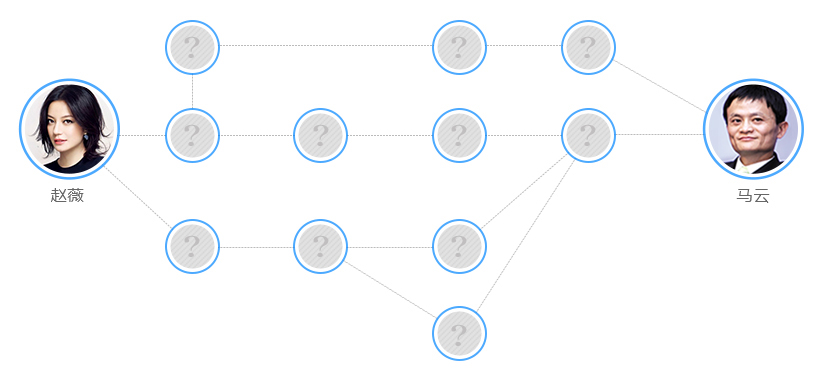

[TOC]

#### 简介

- 定义：一种基于图论实现  NoSQL 的数据库管理系统，用节点和关系、属性表现实体内容

  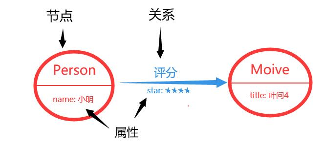

- 特点：

  - 根据其连接的关系可以快速找出其邻近节点

  - 支持 ACID

  - 社区版只能单机使用，企业版才能使用分布式安装（负载均衡与高可用）

- 应用领域

  - 社交网络、推荐引擎、交通物流、欺诈风控

- 不适用场景：

  - 记录大量基于事件的数据

  - 需要对大规模分布式数据进行处理

  - 二进制数据存储

  - 适合保存在关系型数据库的结构化数据

- 下载：https://neo4j.com/download-center/#community

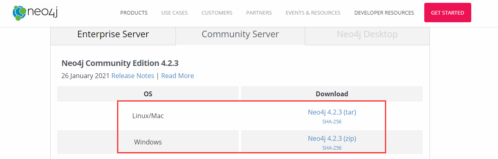

#### 启动

```shell
# 前置依赖 JRE(Java Runtime Environment)

$ cd <NEO4J_HOME>

$ vim ./conf/neo4j.conf
# The name of the default database
dbms.default_database=sanguo

# Bolt connector
dbms.connector.bolt.enabled=true
dbms.connector.bolt.tls_level=DISABLED
dbms.connector.bolt.listen_address=:7687

# HTTP Connector. There can be zero or one HTTP connectors.
dbms.connector.http.enabled=true
dbms.connector.http.listen_address=:7474

$ ./bin/neo4j console
2021-02-27 02:45:15.154+0000 INFO  Starting...
2021-02-27 02:45:21.637+0000 INFO  ======== Neo4j 4.2.3 ========
2021-02-27 02:45:26.105+0000 INFO  Performing postInitialization step for component 'security-users' with version 2 and status CURRENT
2021-02-27 02:45:26.106+0000 INFO  Updating the initial password in component 'security-users'
2021-02-27 02:45:34.404+0000 INFO  Bolt enabled on localhost:7687.
2021-02-27 02:45:35.254+0000 INFO  Remote interface available at http://localhost:7474/
2021-02-27 02:45:35.255+0000 INFO  Started
```

终端 Shell 访问

```shell
$ ./bin/cypher-shell -a 127.0.0.1 -u neo4j -p 123456
Connected to Neo4j using Bolt protocol version 4.2 at neo4j://127.0.0.1:7687 as user neo4j.
Type :help for a list of available commands or :exit to exit the shell.
Note that Cypher queries must end with a semicolon.

neo4j@sanguo> MATCH (n) RETURN n;
+------------------------+
| n                      |
+------------------------+
| (:Country {name: "魏"}) |
| (:Country {name: "吴"}) |
| (:Country {name: "蜀"}) |
+------------------------+
```

浏览器访问：

> 输入数据库名（sanguo），默认用户名及密码（neo4j）
>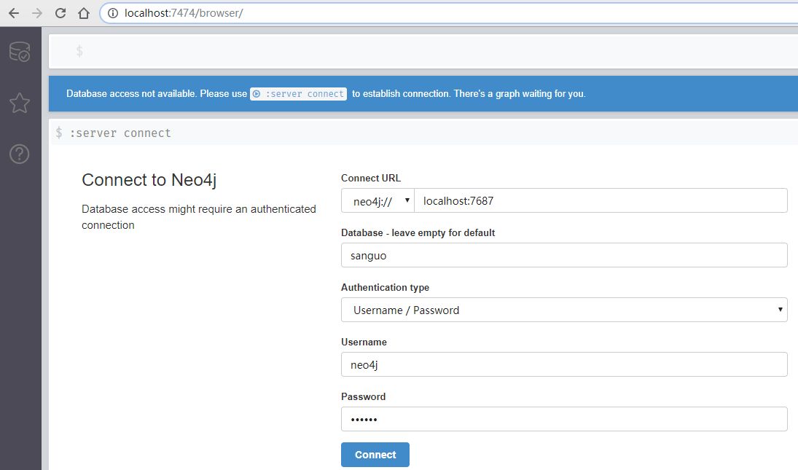
>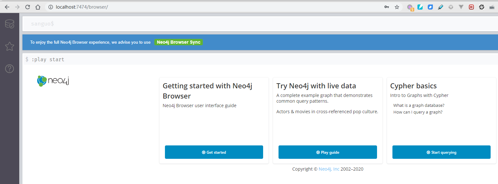

#### 导入数据

##### 准备数据集

```shell
# 查看数据导入的目录
$ less ./conf/neo4j.conf
# This setting constrains all `LOAD CSV` import files to be under the `import` directory. Remove or comment it out to
# allow files to be loaded from anywhere in the filesystem; this introduces possible security problems. See the
# `LOAD CSV` section of the manual for details.
dbms.directories.import=import

# 将数据集（csv）下载至 import 目录
$ wget -O ./import/sanguo.csv 'https://raw.githubusercontent.com/wangfangye/kg-hongloumeng/master/data/data/三国演义/triples.csv'
--2021-02-26 19:21:46--  https://raw.githubusercontent.com/wangfangye/kg-hongloumeng/master/data/data/%E4%B8%89%E5%9B%BD%E6%BC%94%E4%B9%89/triples.csv
Resolving raw.githubusercontent.com (raw.githubusercontent.com)... 185.199.109.133, 185.199.110.133, 185.199.111.133, ...
Connecting to raw.githubusercontent.com (raw.githubusercontent.com)|185.199.109.133|:443... connected.
HTTP request sent, awaiting response... 200 OK
Length: 5926 (5.8K) [text/plain]
Saving to: ‘import/sanguo.csv’

import/sanguo.csv                          100%[======================================================================================>]   5.79K  --.-KB/s    in 0s      

2021-02-26 19:21:47 (26.6 MB/s) - ‘import/sanguo.csv’ saved [5926/5926]

$ ls ./import/
sanguo.csv

$ head ./import/sanguo.csv
"head","tail","relation","label"
"关羽","刘备","younger_sworn_brother","义弟"
"张飞","刘备","younger_sworn_brother","义弟"
"关羽","张飞","elder_sworn_brother","义兄"
"张苞","张飞","son","儿子"
"关兴","关羽","son","儿子"
"关平","张苞","sworn","结拜"
"关平","关羽","adopted_son","义子"
"卢植","刘备","master","师傅"
"公孙瓒","刘备","friend","朋友"
```

##### 创建节点

>LOAD CSV WITH HEADERS FROM 'file:///sanguo.csv' AS line FIELDTERMINATOR ','
MERGE (:Hero { name: line.tail});
>
>LOAD CSV WITH HEADERS FROM 'file:///sanguo.csv' AS line FIELDTERMINATOR ','  
MERGE (:Hero { name: line.head});

>MATCH (n) RETURN n;


##### 创建关系

```shell
$ awk -F ',' '{ print $4 }'  ./import/sanguo.csv | sort | uniq
"label"
"主公"
"义兄"
"义女"
"义子"
"义弟"
"义父"
"儿子"
"叔叔"
"同事"
"同族"
"哥哥"
"堂弟"
"夫"
"女儿"
"女婿"
"妹妹"
"妻"
"妻子"
"妾"
"嫂子"
"岳母"
"师傅"
"弟弟"
"徒弟"
"朋友"
"母亲"
"父亲"
"结拜"
"臣"
"让位"
"诸侯"
```

>LOAD CSV WITH HEADERS FROM 'file:///sanguo.csv' AS line FIELDTERMINATOR ','
MATCH (h1:Hero),(h2:Hero) WHERE h1.name = line.head AND h2.name = line.tail AND line.label = '义女' MERGE (h1)-[:义女]->(h2);
>
>LOAD CSV WITH HEADERS FROM 'file:///sanguo.csv' AS line FIELDTERMINATOR ','
MATCH (h1:Hero),(h2:Hero) WHERE h1.name = line.head AND h2.name = line.tail AND line.label = '义子' MERGE (h1)-[:义子]->(h2);
>
>LOAD CSV WITH HEADERS FROM 'file:///sanguo.csv' AS line FIELDTERMINATOR ','
MATCH (h1:Hero),(h2:Hero) WHERE h1.name = line.head AND h2.name = line.tail AND line.label = '义父' MERGE (h1)-[:义父]->(h2);
>
>LOAD CSV WITH HEADERS FROM 'file:///sanguo.csv' AS line FIELDTERMINATOR ','
MATCH (h1:Hero),(h2:Hero) WHERE h1.name = line.head AND h2.name = line.tail AND line.label = '徒弟' MERGE (h1)-[:徒弟]->(h2);
>
>LOAD CSV WITH HEADERS FROM 'file:///sanguo.csv' AS line FIELDTERMINATOR ','
MATCH (h1:Hero),(h2:Hero) WHERE h1.name = line.head AND h2.name = line.tail AND line.label = '同事' MERGE (h1)-[:同事]->(h2);
>
>LOAD CSV WITH HEADERS FROM 'file:///sanguo.csv' AS line FIELDTERMINATOR ','
MATCH (h1:Hero),(h2:Hero) WHERE h1.name = line.head AND h2.name = line.tail AND line.label = '妾' MERGE (h1)-[:妾]->(h2);
>
>LOAD CSV WITH HEADERS FROM 'file:///sanguo.csv' AS line FIELDTERMINATOR ','
MATCH (h1:Hero),(h2:Hero) WHERE h1.name = line.head AND h2.name = line.tail AND line.label = '女儿' MERGE (h1)-[:女儿]->(h2);
>
>LOAD CSV WITH HEADERS FROM 'file:///sanguo.csv' AS line FIELDTERMINATOR ','
MATCH (h1:Hero),(h2:Hero) WHERE h1.name = line.head AND h2.name = line.tail AND line.label = '让位' MERGE (h1)-[:让位]->(h2);
>
>LOAD CSV WITH HEADERS FROM 'file:///sanguo.csv' AS line FIELDTERMINATOR ','
MATCH (h1:Hero),(h2:Hero) WHERE h1.name = line.head AND h2.name = line.tail AND line.label = '哥哥' MERGE (h1)-[:哥哥]->(h2);
>
>LOAD CSV WITH HEADERS FROM 'file:///sanguo.csv' AS line FIELDTERMINATOR ','
MATCH (h1:Hero),(h2:Hero) WHERE h1.name = line.head AND h2.name = line.tail AND line.label = '义兄' MERGE (h1)-[:义兄]->(h2);
>
>LOAD CSV WITH HEADERS FROM 'file:///sanguo.csv' AS line FIELDTERMINATOR ','
MATCH (h1:Hero),(h2:Hero) WHERE h1.name = line.head AND h2.name = line.tail AND line.label = '父亲' MERGE (h1)-[:父亲]->(h2);
>
>LOAD CSV WITH HEADERS FROM 'file:///sanguo.csv' AS line FIELDTERMINATOR ','
MATCH (h1:Hero),(h2:Hero) WHERE h1.name = line.head AND h2.name = line.tail AND line.label = '朋友' MERGE (h1)-[:朋友]->(h2);
>
>LOAD CSV WITH HEADERS FROM 'file:///sanguo.csv' AS line FIELDTERMINATOR ','
MATCH (h1:Hero),(h2:Hero) WHERE h1.name = line.head AND h2.name = line.tail AND line.label = '夫' MERGE (h1)-[:夫]->(h2);
>
>LOAD CSV WITH HEADERS FROM 'file:///sanguo.csv' AS line FIELDTERMINATOR ','
MATCH (h1:Hero),(h2:Hero) WHERE h1.name = line.head AND h2.name = line.tail AND line.label = '主公' MERGE (h1)-[:主公]->(h2);
>
>LOAD CSV WITH HEADERS FROM 'file:///sanguo.csv' AS line FIELDTERMINATOR ','
MATCH (h1:Hero),(h2:Hero) WHERE h1.name = line.head AND h2.name = line.tail AND line.label = '师傅' MERGE (h1)-[:师傅]->(h2);
>
>LOAD CSV WITH HEADERS FROM 'file:///sanguo.csv' AS line FIELDTERMINATOR ','
MATCH (h1:Hero),(h2:Hero) WHERE h1.name = line.head AND h2.name = line.tail AND line.label = '臣' MERGE (h1)-[:臣]->(h2);
>
>LOAD CSV WITH HEADERS FROM 'file:///sanguo.csv' AS line FIELDTERMINATOR ','
MATCH (h1:Hero),(h2:Hero) WHERE h1.name = line.head AND h2.name = line.tail AND line.label = '母亲' MERGE (h1)-[:母亲]->(h2);
>
>LOAD CSV WITH HEADERS FROM 'file:///sanguo.csv' AS line FIELDTERMINATOR ','
MATCH (h1:Hero),(h2:Hero) WHERE h1.name = line.head AND h2.name = line.tail AND line.label = '岳母' MERGE (h1)-[:岳母]->(h2);
>
>LOAD CSV WITH HEADERS FROM 'file:///sanguo.csv' AS line FIELDTERMINATOR ','
MATCH (h1:Hero),(h2:Hero) WHERE h1.name = line.head AND h2.name = line.tail AND line.label = '诸侯' MERGE (h1)-[:诸侯]->(h2);
>
>LOAD CSV WITH HEADERS FROM 'file:///sanguo.csv' AS line FIELDTERMINATOR ','
MATCH (h1:Hero),(h2:Hero) WHERE h1.name = line.head AND h2.name = line.tail AND line.label = '同族' MERGE (h1)-[:同族]->(h2);
>
>LOAD CSV WITH HEADERS FROM 'file:///sanguo.csv' AS line FIELDTERMINATOR ','
MATCH (h1:Hero),(h2:Hero) WHERE h1.name = line.head AND h2.name = line.tail AND line.label = '嫂子' MERGE (h1)-[:嫂子]->(h2);
>
>LOAD CSV WITH HEADERS FROM 'file:///sanguo.csv' AS line FIELDTERMINATOR ','
MATCH (h1:Hero),(h2:Hero) WHERE h1.name = line.head AND h2.name = line.tail AND line.label = '儿子' MERGE (h1)-[:儿子]->(h2);
>
>LOAD CSV WITH HEADERS FROM 'file:///sanguo.csv' AS line FIELDTERMINATOR ','
MATCH (h1:Hero),(h2:Hero) WHERE h1.name = line.head AND h2.name = line.tail AND line.label = '女婿' MERGE (h1)-[:女婿]->(h2);
>
>LOAD CSV WITH HEADERS FROM 'file:///sanguo.csv' AS line FIELDTERMINATOR ','
MATCH (h1:Hero),(h2:Hero) WHERE h1.name = line.head AND h2.name = line.tail AND line.label = '堂弟' MERGE (h1)-[:堂弟]->(h2);
>
>LOAD CSV WITH HEADERS FROM 'file:///sanguo.csv' AS line FIELDTERMINATOR ','
MATCH (h1:Hero),(h2:Hero) WHERE h1.name = line.head AND h2.name = line.tail AND line.label = '结拜' MERGE (h1)-[:结拜]->(h2);
>
>LOAD CSV WITH HEADERS FROM 'file:///sanguo.csv' AS line FIELDTERMINATOR ','
MATCH (h1:Hero),(h2:Hero) WHERE h1.name = line.head AND h2.name = line.tail AND line.label = '叔叔' MERGE (h1)-[:叔叔]->(h2);
>
>LOAD CSV WITH HEADERS FROM 'file:///sanguo.csv' AS line FIELDTERMINATOR ','
MATCH (h1:Hero),(h2:Hero) WHERE h1.name = line.head AND h2.name = line.tail AND line.label = '妻子' MERGE (h1)-[:妻子]->(h2);
>
>LOAD CSV WITH HEADERS FROM 'file:///sanguo.csv' AS line FIELDTERMINATOR ','
MATCH (h1:Hero),(h2:Hero) WHERE h1.name = line.head AND h2.name = line.tail AND line.label = '弟弟' MERGE (h1)-[:弟弟]->(h2);
>
>LOAD CSV WITH HEADERS FROM 'file:///sanguo.csv' AS line FIELDTERMINATOR ','
MATCH (h1:Hero),(h2:Hero) WHERE h1.name = line.head AND h2.name = line.tail AND line.label = '妹妹' MERGE (h1)-[:妹妹]->(h2);
>
>LOAD CSV WITH HEADERS FROM 'file:///sanguo.csv' AS line FIELDTERMINATOR ','
MATCH (h1:Hero),(h2:Hero) WHERE h1.name = line.head AND h2.name = line.tail AND line.label = '义弟' MERGE (h1)-[:义弟]->(h2);

>MATCH (n) RETURN n
>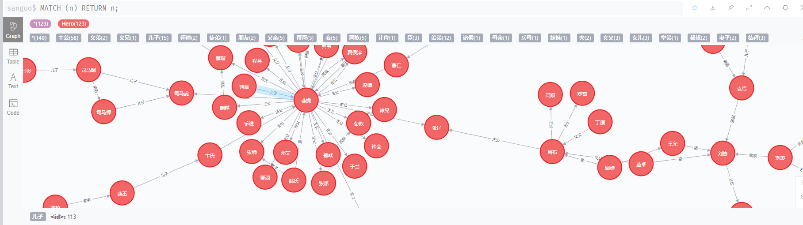

#### 索引

> RETURN (:Hero{name:"曹操"})-[*..1]->(:Hero)
>
> 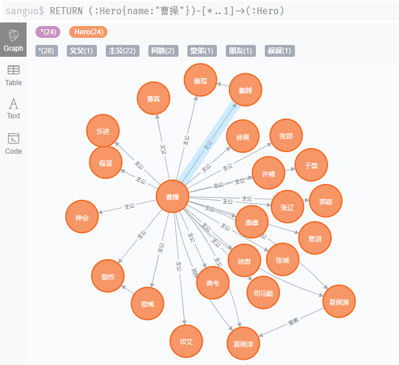

> PROFILE RETURN (:Hero{name:"曹操"})-[*..1]->(:Hero)
> EXPLAIN RETURN (:Hero{name:"曹操"})-[*..1]->(:Hero)
>
> 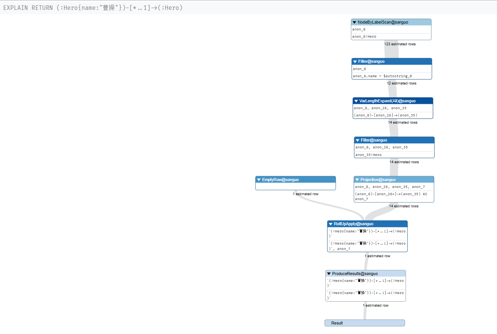


##### 创建索引

>唯一索引：CREATE CONSTRAINT ON (h:Hero) ASSERT h.name IS UNIQUE
>普通索引：CREATE INDEX FOR (n:Hero) ON (n.name)

>:schema
>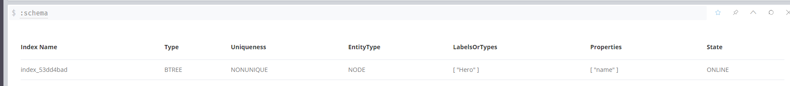

>RETURN (:Hero{name:"曹操"})-[*..1]->(:Hero)
>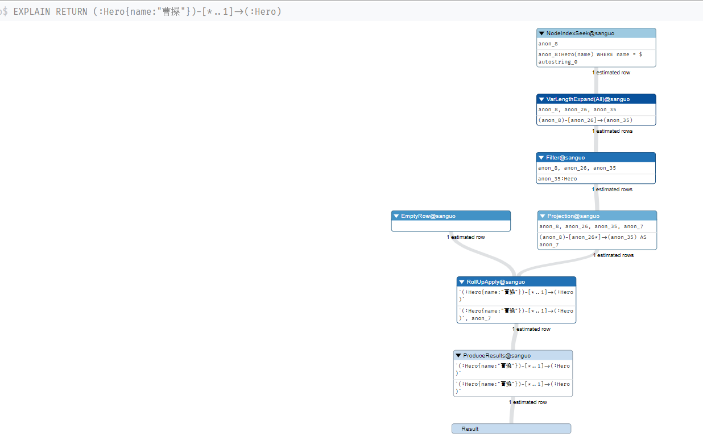

##### 删除索引

>删除唯一索引：DROP CONSTRAINT ON (h:Hero) ASSERT h.name IS UNIQUE
>删除普通索引：DRO INDEX index_53dd4bad 

#### CQL（Cypher Query Language）

- 语句结构

  ```cypher
  [MATCH WHERE]
  [OPTIONAL MATCH WHERE]
  [WITH [ORDER BY] [SKIP] [LIMIT]]
  (CREATE [UNIQUE] | MERGE)*
  [SET | DELETE | REMOVE | FOREACH]*
  [RETURN [ORDER BY] [SKIP] [LIMIT]]
  ```

- 运算符
  + `+, -, *, /, %, ^`
  + `=, <>, <, >, <=, >=`
  + `AND, OR, XOR, NOT`
  + 字符串运算符：`+`
  + 列表运算符：`+, IN, [x], [x .. y]`
  + 正则表达式运算符：`=~`
  + 字符串匹配运算符：`STARTS WITH, ENDS WITH, CONTAINS`

```cypher
# (变量别名:节点)-[关系别名:关系]->(变量别名2:节点2)-[:关系2]->()-[*..N]->(:节点3)
                  
# 查找
match p=shortestPath((m:Hero{name:"曹操"})-[*]-(n:Hero{name:"袁绍"})) return p;

MATCH (n:Hero) WHERE id(n)= 121 RETURN n;
MATCH (n:Hero) WHERE n.name="刘备" RETURN n;
MATCH (n:Hero{name:"刘备"}) RETURN n;
MATCH (n:Hero) WHERE n.name IN ["曹操", "刘备", "孙权"] RETURN n AS result;
MATCH (n:Hero) WHERE n.name STARTS WITH "曹" RETURN n;
MATCH (n:Hero) WHERE n.name <> "刘备" AND n.name STARTS WITH "刘" RETURN n;
MATCH (n:Hero) WHERE n.name STARTS WITH "刘" RETURN n.name UNION MATCH (n:Hero) WHERE n.name STARTS WITH "曹" RETURN n.name;
MATCH (m:Hero{name:"曹操"})-[:大王]->(n) WHERE n.name STARTS WITH "夏侯" WITH m, COUNT(n) AS count_n RETURN count_n

# 更新
match (n:Hero{name:"超昂"}) set n.name = "曹昂"

# 创建
WITH ["魏", "吴", "蜀"] as col FOREACH (v IN col | CREATE (:Country{name:v}))

match (n:Hero{name:"甄氏"}) return n;
create (:Hero{name:"甄氏"});
match (m:Hero{name:"袁熙"}),(n:Hero{name:"曹丕"}) create (o:Hero{name:"甄氏"}), (o)-[:妻子]->(m),(o)-[:妾]->(n);

match (m:Hero{name:"黄月英"}), (n:Hero{name:"诸葛亮"}) create (m)-[:妻子]->(n);        
match (m:Hero{name:"张飞"}), (n:Hero{name:"刘禅"}) create (m)-[:岳父]->(n);

match p=((n:Hero{name:"孙权"})-[*..4]-(m:Hero)) return p;
match (m:Hero{name:"孙坚"}),(n:Hero{name:"袁术"}) create (m)-[:臣]->(n);
match (m:Hero{name:"曹嵩"}) create (:Hero{name:"曹腾"})-[:义父]->(m);
match (:Hero{name:"曹腾"})-[r:义父]-(:Hero{name:"曹嵩"}) delete r;
match (m:Hero{name:"曹腾"}) delete m;

# 删除
match (m:Hero{name:"甄氏"}) detach delete m

match (m:Hero)-[r:主公]->(n:Hero) create (m)-[:大王]->(n)
match (m:Hero)-[r:主公]->(n:Hero) delete r
```

#### 客户端驱动

> 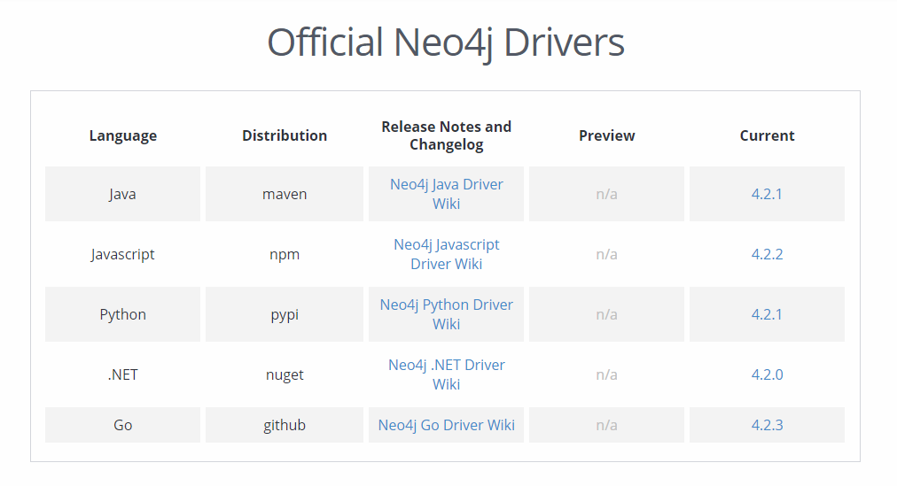
 https://neo4j.com/download-center/#community 

**以 Node.js 为例**

```shell
npm install neo4j-driver
```

```js
const neo4j = require("neo4j-driver")

var driver = neo4j.driver("bolt://localhost:7687", neo4j.auth.basic("neo4j", "123456"))

var session = driver.session();

session.run("MATCH (h:Hero) WHERE h.name STARTS WITH '曹' RETURN h")
.then(function(result) {
    var records = result.records
    records.forEach((val, idx) => {
        console.log(val._fields[0].properties)
    })
}, function (err) {
    console.log(err)
})
```

```shell
$ node index.js
{ name: '曹操' }
{ name: '曹嵩' }
{ name: '曹真' }
{ name: '曹仁' }
{ name: '曹丕' }
{ name: '曹爽' }
{ name: '曹纯' }
{ name: '曹植' }
```

#### 参考

- Cypher 语法：https://neo4j.com/docs/cypher-manual/4.2/
- 示例数据集：https://github.com/wangfangye/kg-hongloumeng/tree/master/data/data
- 《Neo4j 全栈开发》：https://www.jb51.net/books/701559.html
-  https://gitbook.cn/books/5a33782c5778440a9d906017/index.html 
- https://blog.csdn.net/RHJlife/article/details/108586578
- http://www.openkg.cn/group


#### TODO

底层数据存储（原生、关系型数据库）

