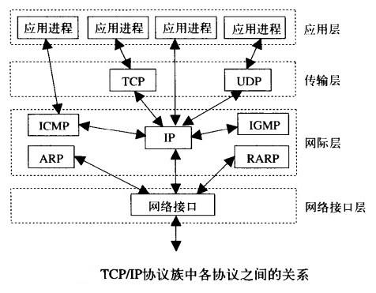
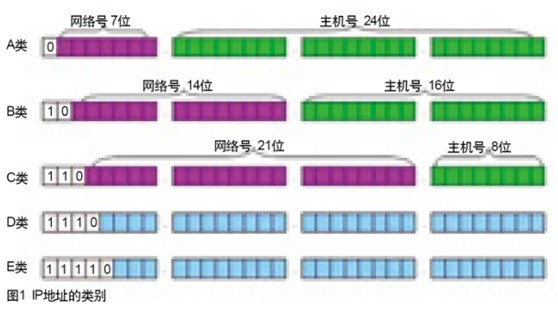
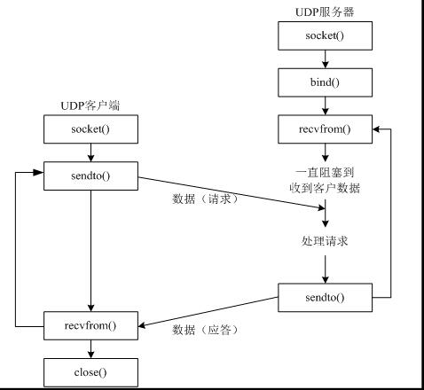
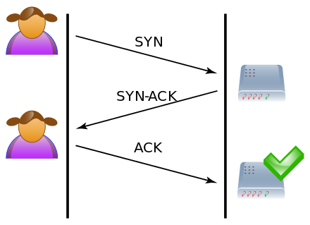

## 网络笔记 1

### TCP/IP 分层协议簇

### 端口
- 周知端口 0~1023、动态端口 1024~65535
- 查看端口状态：`netstat －an`

### IP 地址分类

- A 类
  - 1.0.0.1~126.255.255.254
  - 00000001 00000000 00000000 00000001 - 01111110 11111111 11111111 11111110
  - 网络 126 个，每个网络 1677214 个主机
- B 类
  - 128.1.0.1~191.255.255.254
  - 10000000 00000001 00000000 00000001 - 10111111 11111111 11111111 11111110
  - 网络 16384 个，每个网络 65534 主机
- C 类
  - 192.0.1.1~223.255.255.254
  - 11000000 00000000 00000001 00000001 - 11011111 11111111 11111110 11111110
  - 网络 2097152 个，每个网络 254 个主机
- D 类（用于多点广播）
  - 224.0.0.1-239.255.255.254
- E 类（保留，仅作实验和开发使用）
- 私有 IP
  - 10.0.0.0~10.255.255.255
  - 172.16.0.0~172.31.255.255
  - 192.168.0.0~192.168.255.255
  - 回路测试：127．0．0．1~127．255．255．255

### 子网掩码
  - 作用：将某个IP地址划分成网络地址和主机地址两部分
  - 组成：左边为网络位（二进制 1），右边为主机位（二进制 0）
  - 例：IP 192.168.1.1，子网掩码 255.255.255.0
  - 主机号全为 0，表示网络号；主机号全为 1，表示网络广播

### UDP 网络通过过程

### TFTP

### TCP

### 相关工具
  - wireshark
  - Packet Tracer(思科网络模拟器)
    + hub 集线器
      - 能够完成多个电脑的链接
      - 每个数据包的发送都是以广播的形式进行的，容易堵塞网络
    + switch 交换机
      - 转发过滤：当一个数据帧的目的地址在MAC地址表中有映射时，它被转发到连接目的节点的端口而不是所有端口（如该数据帧为广播帧则转发至所有端口）
      - 学习功能：以太网交换机了解每一端口相连设备的MAC地址，并将地址同相应的端口映射起来存放在交换机缓存中的MAC地址表中
    + router 路由器（网关设备）：用于连接多个逻辑上分开的网络
  - 组网

### TCP 连接过程
#### 三次握手

#### 四次挥手

#### 十种状态

#### 2MSL 问题

#### 长链接和短链接

### 常见攻击案例
#### TCP 半链接攻击(SYN Flood)
##### 正常时

##### 攻击时

#### DNS 攻击
##### DNS 服务器劫持

##### DNS 欺骗

#### ARP 攻击

### 家庭上网解析

### 相关链接
[Python 笔记 3(网络相关)](/2019/01/08/python-note-3/)

### 编辑记录

创建：01-08-2019 22:00 周二 
编辑：01-09-2019 22:00 周三 
编辑：01-12-2019 18:47 周六 
