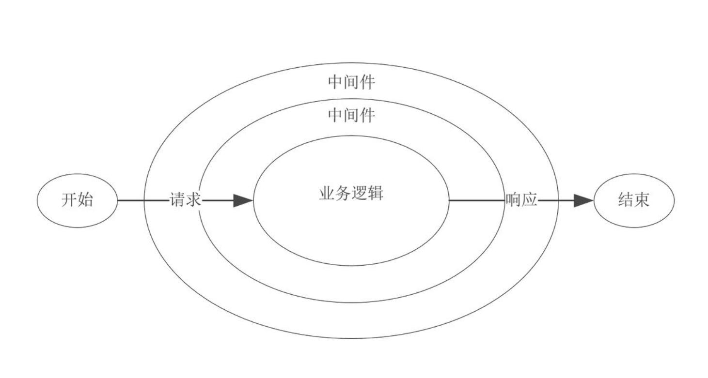

# Node 中间件机制

理解 Node.js 中间件机制核心代码的实现，加深对中间件机制的理解，有助于更好的使用和编写中间件。

### 一、中间件概念

在 `Node.js` 中，中间件主要是指封装所有 `Http` 请求细节处理的方法。一次 `Http` 请求通常包含很多工作，如记录日志、`ip` 过滤、查询字符串、请求体解析、`Cookie` 处理、权限验证、参数验证、异常处理等，但对于 `Web` 应用而言，并不希望接触到这么多细节性的处理，因此引入中间件来简化和隔离这些基础设施与业务逻辑之间的细节，让开发者能够关注在业务的开发上，以达到提升开发效率的目的。

中间件的行为比较类似 `Java` 中过滤器的工作原理，就是在进入具体的业务处理之前，先让过滤器处理。它的工作模型下图所示。



### 二、中间件机制核心实现

中间件是从 `Http` 请求发起到响应结束过程中的处理方法，通常需要对请求和响应进行处理，因此一个基本的中间件的形式如下：

```js
const middleware = (req, res, next) => {
  // TODO
  next()
}
```

以下通过两种方式的中间件机制的实现来理解中间件是如何工作的。

#### 1、方式一

如下定义三个简单的中间件：

```js
const middleware1 = (req, res, next) => {
  console.log('middleware1 start')
  next()
}

const middleware2 = (req, res, next) => {
  console.log('middleware2 start')
  next()
}

const middleware3 = (req, res, next) => {
  console.log('middleware3 start')
  next()
}
```

通过递归的形式，将后续中间件的执行方法传递给当前中间件，在当前中间件执行结束，通过调用 `next()` 方法执行后续中间件的调用。

```js
// 中间件数组
const middlewares = [middleware1, middleware2, middleware3]
function run (req, res) {
  const next = () => {
    // 获取中间件数组中第一个中间件
    const middleware = middlewares.shift()
    if (middleware) {
      middleware(req, res, next)
    }
  }
  next()
}
run() // 模拟一次请求发起
```

执行以上代码，可以看到如下结果：

```s
middleware1 start
middleware2 start
middleware3 start
```

如果中间件中有异步操作，需要在异步操作的流程结束后再调用 `next()` 方法，否则中间件不能按顺序执行。改写 `middleware2` 中间件：

```js
const middleware2 = (req, res, next) => {
  console.log('middleware2 start')
  new Promise(resolve => {
    setTimeout(() => resolve(), 1000)
  }).then(() => {
    next()
  })
}
```

执行结果与之前一致，不过middleware3会在middleware2异步完成后执行。


#### 2、方式二

有些中间件不止需要在业务处理前执行，还需要在业务处理后执行，比如统计时间的日志中间件。在方式一情况下，无法在 `next()` 为异步操作时再将当前中间件的其他代码作为回调执行。因此可以将`next()` 方法的后续操作封装成一个 `Promise` 对象，中间件内部就可以使用 `next.then()`形式完成业务处理结束后的回调。改写 `run()` 方法如下：

```js
function run (req, res) {
  const next = () => {
    const middleware = middlewares.shift()
    if (middleware) {
      // 将middleware(req, res, next)包装为Promise对象
      return Promise.resolve(middleware(req, res, next))
    }
  }
  next()
}
```

中间件的调用方式需改写为：

```js
const middleware1 = (req, res, next) => {
  console.log('middleware1 start')
  // 所有的中间件都应返回一个Promise对象
  // Promise.resolve()方法接收中间件返回的Promise对象，供下层中间件异步控制
  return next().then(() => {
    console.log('middleware1 end')
  })
}
```

得益于 `async` 函数的自动异步流程控制，中间件也可以用如下方式来实现：

```js
// async函数自动返回Promise对象
const middleware2 = async (req, res, next) => {
  console.log('middleware2 start')
  await new Promise(resolve => {
    setTimeout(() => resolve(), 1000)
  })
  await next()
  console.log('middleware2 end')
}

const middleware3 = async (req, res, next) => {
  console.log('middleware3 start')
  await next()
  console.log('middleware3 end')
}
```

执行结果如下：


以上描述了中间件机制中多个异步中间件的调用流程，实际中间件机制的实现还需要考虑异常处理、路由等。

在 `express` 框架中，中间件的实现方式为方式一，并且全局中间件和内置路由中间件中根据请求路径定义的中间件共同作用，不过无法在业务处理结束后再调用当前中间件中的代码。`koa2` 框架中中间件的实现方式为方式二，将 `next()` 方法返回值封装成一个 `Promise`，便于后续中间件的异步流程控制，实现了 `koa2` 框架提出的洋葱圈模型，即每一层中间件相当于一个球面，当贯穿整个模型时，实际上每一个球面会穿透两次。


`koa2` 框架的中间件机制实现得非常简洁和优雅，这里学习一下框架中组合多个中间件的核心代码。

```js
function compose (middleware) {
  if (!Array.isArray(middleware)) throw new TypeError('Middleware stack must be an array!')
  for (const fn of middleware) {
    if (typeof fn !== 'function') throw new TypeError('Middleware must be composed of functions!')
  }
  return function (context, next) {
    let index = -1
    return dispatch(0)
    function dispatch (i) {
      // index会在next()方法调用后累加，防止next()方法重复调用
      if (i <= index) return Promise.reject(new Error('next() called multiple times'))
      index = i
      let fn = middleware[i]
      if (i === middleware.length) fn = next
      if (!fn) return Promise.resolve()
      try {
        // 核心代码
        // 包装next()方法返回值为Promise对象
        return Promise.resolve(fn(context, dispatch.bind(null, i + 1)));
      } catch (err) {
        // 遇到异常中断后续中间件的调用
        return Promise.reject(err)
      }
    }
  }
}
```

### 三、中间件社区

在后续 `Node.js` 学习和应用中，建议使用 `koa2` 框架作为基础框架，这里列出了一些使用比较多的中间件。

koa-router：路由中间件
koa-bodyparser：http请求主体解析
koa-static：代理静态文件
koa-compress：gzip压缩
koa-logger：日志记录
koa-convert：转换koa1.x版本的中间件
kcors：跨域中间件
koa中间件列表地址：https://github.com/koajs/koa/wiki

### 四、总结

本文主要介绍了中间件的概念、为何引入中间件以及中间件机制的核心实现。中间件机制使得 `Web` 应用具备良好的可扩展性和组合性。

在实现中间件时，单个中间件应该足够简单，职责单一。由于每个请求都会调用中间件相关代码，中间件的代码应该高效，必要的时候可以缓存重复获取的数据。在对不同的路由使用中间件时，还应该考虑到不同的中间件应用到不同的路由上。
