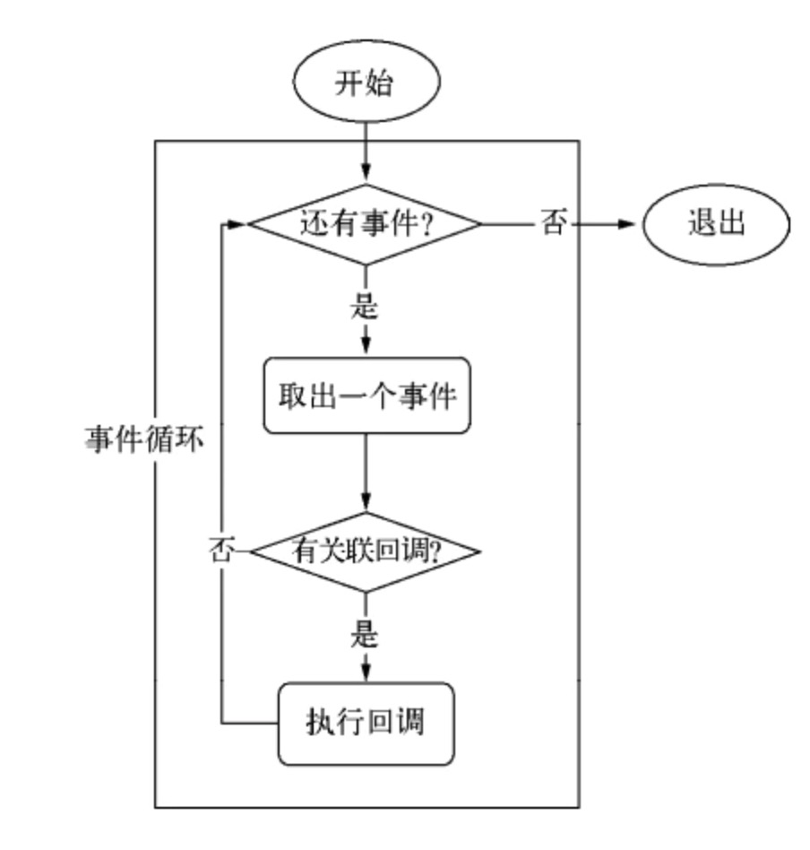
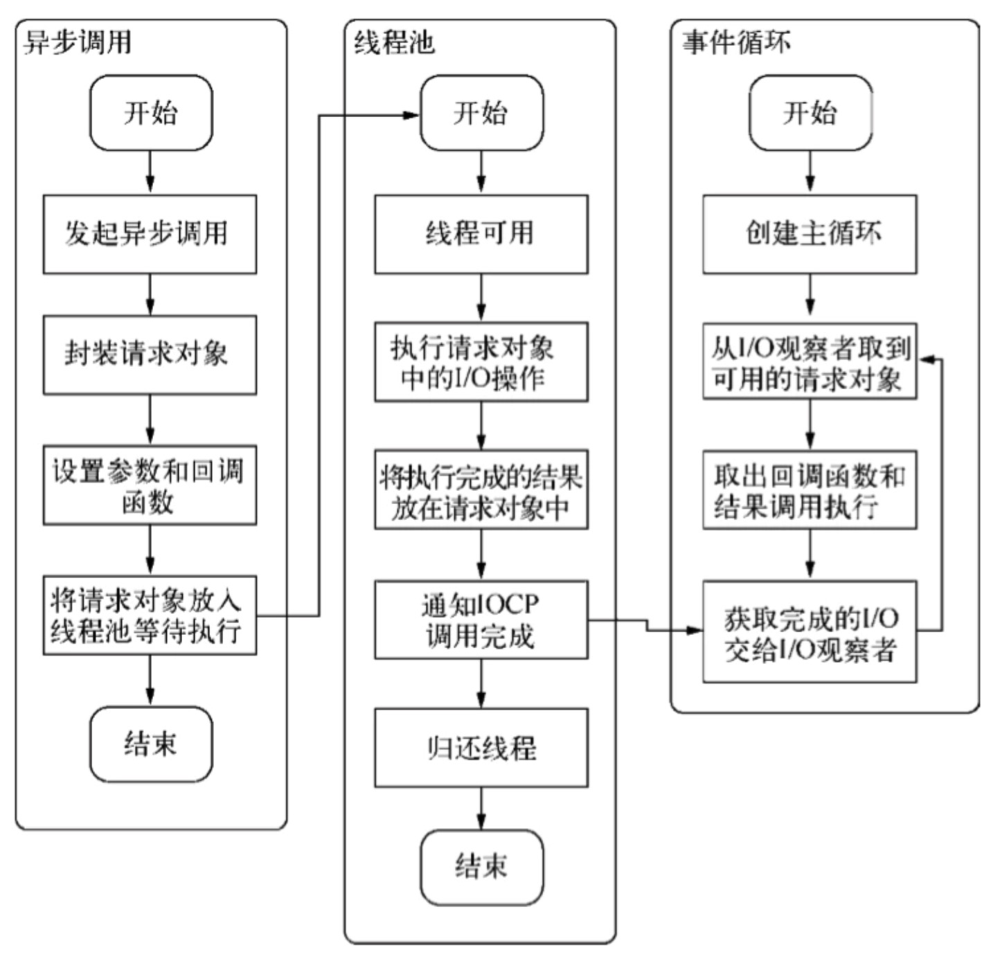

# Node中的事件循环和异步API

### 1、介绍

单线程编程会因阻塞I/O导致硬件资源得不到更优的使用。多线程编程也因为编程中的死锁、状态同步等问题让开发人员头痛。
Node在两者之间给出了它的解决方案：利用单线程，远离多线程死锁、状态同步等问题；利用异步I/O，让单线程远离阻塞，以好使用CPU。

实际上，node只是在应用层属于单线程，底层其实通过libuv维护了一个阻塞I/O调用的线程池。

> 但是：在应用层面，JS是单线程的，业务代码中不能存在耗时过长的代码，否则可能会严重拖后续代码（包括回调）的处理。如果遇到需要复杂的业务计算时，应当想办法启用独立进程或交给其他服务进行处理。

#### 1.1 异步I/O

在Node中，JS是在单线程中执行的没错，但是内部完成I/O工作的另有线程池，使用一个主进程和多个I/O线程来模拟异步I/O。

当主线程发起I/O调用时，I/O操作会被放在I/O线程来执行，主线程继续执行下面的任务，在I/O线程完成操作后会带着数据通知主线程发起回调。

#### 1.2 事件循环

事件循环是Node的执行模型，正是这种模型使得回调函数非常普遍。

在进程启动时，Node便会创建一个类似while(true)的循环，执行每次循环的过程就是判断有没有待处理的事件，如果有，就取出事件及其相关的回调并执行他们，然后进入下一个循环。如果不再有事件处理，就退出进程。



Event loop是一种程序结构，是实现异步的一种机制。Event loop可以简单理解为：

- 所有任务都在主线程上执行，形成一个执行栈（execution context stack）。

- 主线程之外，还存在一个"任务队列"（task queue）。系统把异步任务放到"任务队列"之中，然后主线程继续执行后续的任务。

- 一旦"执行栈"中的所有任务执行完毕，系统就会读取"任务队列"。如果这个时候，异步任务已经结束了等待状态，就会从"任务队列"进入执行栈，恢复执行。

- 主线程不断重复上面的第三步。

**Node中事件循环阶段解析:**

```
   ┌───────────────────────┐
┌─>│        timers         │
│  └──────────┬────────────┘
│  ┌──────────┴────────────┐
│  │     I/O callbacks     │
│  └──────────┬────────────┘
│  ┌──────────┴────────────┐
│  │     idle, prepare     │
│  └──────────┬────────────┘      ┌───────────────┐
│  ┌──────────┴────────────┐      │   incoming:   │
│  │         poll          │<─────┤ connections,  │
│  └──────────┬────────────┘      │  data, etc.   │
│  ┌──────────┴────────────┐      └───────────────┘
│  │         check         │
│  └──────────┬────────────┘
│  ┌──────────┴────────────┐
└──┤    close callbacks    │
   └───────────────────────┘
```

每个阶段都有一个FIFO的回调队列（queue）要执行。而每个阶段有自己的特殊之处，简单说，就是当event loop进入某个阶段后，会执行该阶段特定的（任意）操作，然后才会执行这个阶段的队列里的回调。当队列被执行完，或者执行的回调数量达到上限后，event loop会进入下个阶段。

**Phases Overview 阶段总览**

- timers: 这个阶段执行setTimeout()、setInterval()设定的回调。
- I/O callbacks: 执行几乎所有的回调，除了close callbacks、setTimeout()、setInterval()、setImmediate()的回调。
- idle, prepare: 仅内部使用。
- poll: 获取新的I/O事件；node会在适当条件下阻塞在这里。
- check: 执行setImmediate()设定的回调。
- close callbacks: 执行比如socket.on('close', ...)的回调。

**1. timers**

一个timer指定一个下限时间而不是准确时间，定时器setTimeout()和setInterval()在达到这个下限时间后执行回调。在指定的时间过后，timers会尽早的执行回调，但是系统调度或者其他回调的执行可能会延迟它们。

从技术上来说，poll阶段控制timers什么时候执行，而执行的具体位置在timers。

下限的时间有一个范围：[1, 2147483647]，如果设定的时间不在这个范围，将被设置为1。

**2. I/O callbacks**

执行除了close callbacks、setTimeout()、setInterval()、setImmediate()回调之外几乎所有回调，比如说TCP连接发生错误。

**3. idle, prepare**

系统内部的一些调用。


**4. poll**

这是最复杂的一个阶段。poll会检索新的I/O events，并且会在合适的时候阻塞，等待回调被加入。

poll阶段有两个主要的功能：一是执行下限时间已经达到的timers的回调，一是处理poll队列里的事件。
注：Node很多API都是基于事件订阅完成的，这些API的回调应该都在poll阶段完成。

当事件循环进入poll阶段：

- poll队列不为空的时候，事件循环肯定是先遍历队列并同步执行回调，直到队列清空或执行回调数达到系统上限。
- poll队列为空的时候，这里有两种情况。

  - 如果代码已经被setImmediate()设定了回调，那么事件循环直接结束poll阶段进入check阶段来执行check队列里的回调。
  - 如果代码没有被设定setImmediate()设定回调：

    - 如果有被设定的timers，那么此时事件循环会检查timers，如果有一个或多个timers下限时间已经到达，那么事件循环将绕回timers阶段，并执行timers的有效回调队列。
    - 如果没有被设定timers，这个时候事件循环是阻塞在poll阶段等待事件回调被加入poll队列。

Node的很多API都是基于事件订阅完成的，比如fs.readFile，这些回调应该都在poll阶段完成。

**5. check**
setImmediate()在这个阶段执行。

这个阶段允许在poll阶段结束后立即执行回调。如果poll阶段空闲，并且有被setImmediate()设定的回调，那么事件循环直接跳到check执行而不是阻塞在poll阶段等待poll 事件们 (poll events)被加入。

注意：如果进行到了poll阶段，setImmediate()具有最高优先级，只要poll队列为空且注册了setImmediate()，无论是否有timers达到下限时间，setImmediate()的代码都先执行。

**6. close callbacks**
如果一个socket或handle被突然关掉（比如socket.destroy()），close事件将在这个阶段被触发，否则将通过process.nextTick()触发。

#### 1.3 请求对象

对于Node中的异步I/O调用而言，回调函数不由开发者来调用，从JS发起调用到I/O操作完成，存在一个中间产物，叫请求对象。

在JS发起调用后，JS调用Node的核心模块，核心模块调用C++内建模块，內建模块通过libuv判断平台并进行系统调用。在进行系统调用时，从JS层传入的方法和参数都被封装在一个请求对象中，请求对象被放在线程池中等待执行。JS立即返回继续后续操作。

#### 1.4 执行回调

在线程可用时，线程会取出请求对象来执行I/O操作，执行完后将结果放在请求对象中，并归还线程。
在事件循环中，I/O观察者会不断的找到线程池中已经完成的请求对象，从中取出回调函数和数据并执行。



跑完当前执行环境下能跑完的代码。每一个事件消息都被运行直到完成为止，在此之前，任何其他事件都不会被处理。这和C等一些语言不通，它们可能在一个线程里面，函数跑着跑着突然停下来，然后其他线程又跑起来了。JS这种机制的一个典型的坏处，就是当某个事件处理耗时过长时，后面的事件处理都会被延后，直到这个事件处理结束，在浏览器环境中运行时，可能会出现某个脚本运行时间过长，页面无响应的提示。Node环境则可能出现大量用户请求被挂起，不能及时响应的情况。

### 2、非I/O的异步API

Node中除了异步I/O之外，还有一些与I/O无关的异步API，分别是：setTimeout()、setInterval()、process.nextTick()、setImmediate()，他们并不是像普通I/O操作那样真的需要等待事件异步处理结束再进行回调，而是出于定时或延迟处理的原因才设计的。

#### 2.1 setTimeout()与setInterval()

这两个方法实现原理与异步I/O相似，只不过不用I/O线程池的参与。

使用它们创建的定时器会被放入timers队列的一个红黑树中，每次事件循环执行时会从相应队列中取出并判断是否超过定时时间，超过就形成一个事件，回调立即执行。

所以，和浏览器中一样，这个并不精确，会被长时间的同步事件阻塞。


值得一提的是，在Node的setTimeout的源码中：

```js
// Node源码
after *= 1; // coalesce to number or NaN
if (!(after >= 1 && after <= TIMEOUT_MAX)) {
  if (after > TIMEOUT_MAX) {
    process.emitWarning(...);
  }
  after = 1; // schedule on next tick, follows browser behavior
}
```

意思是如果没有设置这个after，或者小于1，或者大于TIMEOUT_MAX（2^31-1），都会被强制设置为1ms。也就是说setTimeout(xxx,0)其实等同于setTimeout(xxx,1)。

#### 2.2 setImmediate()

setImmediate()是放在check阶段执行的，实际上是一个特殊的timer，跑在event loop中一个独立的阶段。它使用libuv的API来设定在 poll 阶段结束后立即执行回调。

来看看这个例子：

```js
setTimeout(function() {
  console.log('setTimeout')
}, 0)
setImmediate(function() {
  console.log('setImmediate')
}) // 输出不稳定
```

setTimeout与setImmediate先后入队之后，首先进入的是timers阶段，如果我们的机器性能一般或者加入了一个同步长耗时操作，那么进入timers阶段，1ms已经过去了，那么setTimeout的回调会首先执行。

如果没有到1ms，那么在timers阶段的时候，超时时间没到，setTimeout回调不执行，事件循环来到了poll阶段，这个时候队列为空，此时有代码被setImmediate()，于是先执行了setImmediate()的回调函数，之后在下一个事件循环再执行setTimemout的回调函数。

```js
setTimeout(function() {
  console.log('set timeout')
}, 0)
setImmediate(function() {
  console.log('set Immediate')
})
for (let i = 0; i < 100000; i++) {}           // 可以保证执行时间超过1ms
// 稳定输出： setTimeout    setImmediate
```
这样就可以稳定输出了。

再一个栗子：

```js
const fs = require('fs')
fs.readFile('./filePath.js', (err, data) => {
  setTimeout(() => console.log('setTimeout') , 0)
  setImmediate(() => console.log('setImmediate'))
  console.log('开始了')
  for (let i = 0; i < 100000; i++) {}        
}) // 输出 开始了 setImmediate setTimeout
```

这里我们就会发现，setImmediate永远先于setTimeout执行。

fs.readFile的回调是在poll阶段执行的，当其回调执行完毕之后，setTimeout与setImmediate先后入了timers与check的队列，继续到poll，poll队列为空，此时发现有setImmediate，于是事件循环先进入check阶段执行回调，之后在下一个事件循环再在timers阶段中执行setTimeout回调，虽然这个setTimeout已经到了超时时间。

再来个栗子：

同样的，这段代码也是一样的道理：

```js
setTimeout(() => {
  setImmediate(() => console.log('setImmediate') )
  setTimeout(() => console.log('setTimeout') , 0)
}, 0)
```

以上的代码在timers阶段执行外部的setTimeout回调后，内层的setTimeout和setImmediate入队，之后事件循环继续往后面的阶段走，走到poll阶段的时候发现队列为空，此时有代码被setImmedate()，所以直接进入check阶段执行响应回调（注意这里没有去检测timers队列中是否有成员到达超时事件，因为setImmediate()优先）。之后在下一个事件循环的timers阶段中再去执行相应的回调。

#### 2.3 process.nextTick()与Promise

对于这两个，我们可以把它们理解成一个微任务。也就是说，它们其实不属于事件循环的一部分。

有时我们想要立即异步执行一个任务，可能会使用延时为0的定时器，但是这样开销很大。我们可以换而使用process.nextTick()，它会将传入的回调放入nextTickQueue队列中，下一轮Tick之后取出执行，不管事件循环进行到什么地步，都在当前执行栈的操作结束的时候调用，参见Nodejs官网。

process.nextTick方法指定的回调函数，总是在当前执行队列的尾部触发，多个process.nextTick语句总是一次执行完（不管它们是否嵌套），递归调用process.nextTick，将会没完没了，主线程根本不会去读取事件队列，导致阻塞后续调用，直至达到最大调用限制。

相比于在定时器中采用红黑树树的操作时间复杂度为0(lg(n))，而process.nextTick()的时间复杂度为0(1)，相比之下更高效。

来举一个复杂的栗子，这个栗子搞懂基本上就全部理解了：

```js
setTimeout(() => {
  process.nextTick(() => console.log('nextTick1'))
  
  setTimeout(() => {
    console.log('setTimout1')
    process.nextTick(() => {
      console.log('nextTick2')
      setImmediate(() => console.log('setImmediate1'))
      process.nextTick(() => console.log('nextTick3'))
    })
    setImmediate(() => console.log('setImmediate2'))
    process.nextTick(() => console.log('nextTick4'))
    console.log('sync2')
    setTimeout(() => console.log('setTimout2'), 0)
  }, 0)
  
  console.log('sync1')
}, 0) 
// 输出： sync1 nextTick1 setTimout1 sync2 nextTick2 nextTick4 nextTick3 setImmediate2 setImmediate1 setTimout2
```

#### 2.4 结论

- process.nextTick()，效率最高，消费资源小，但会阻塞CPU的后续调用；
- setTimeout()，精确度不高，可能有延迟执行的情况发生，且因为动用了红黑树，所以消耗资源大；
- setImmediate()，消耗的资源小，也不会造成阻塞，但效率也是最低的。