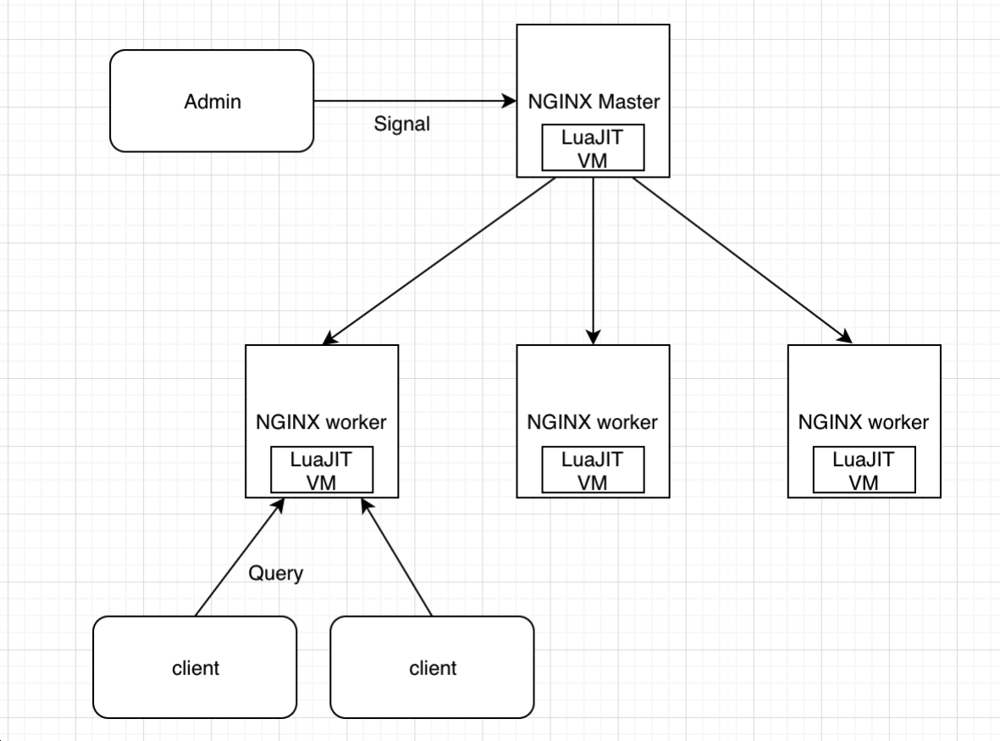
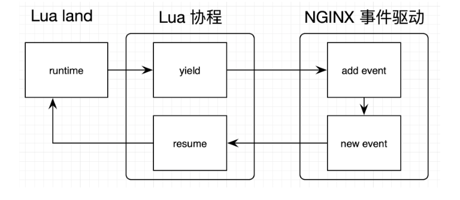
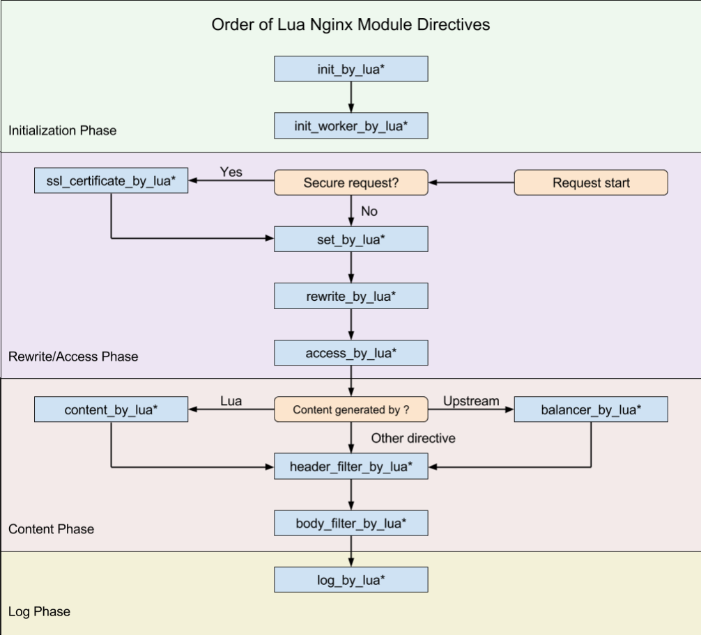

### OpenResty

#### 核心组成

- Nginx

- lua-nginx-module 模块

  + 将 LuaJIT 虚拟机嵌入其中
  
  **LuaJIT(Lua Just-In-Time)与标准 Lua 的关系**
  
    > 标准 Lua: 由编译器编译为字节码，再由 Lua 虚拟机执行
    >
    > LuaJIT: 在执行字节码的同时记录运行时的统计信息（如某个函数/循环的实际运行次数），当这些次数超过某个阈值时，会触发 JIT 编译器编译（把字节码转为中间码，再生成目标体系结构的机器码）
  
    **LuaJIT NYI(Not Yet Implemented)原语 <http://wiki.luajit.org/NYI >**
  
  有些函数 JIT 由于不支持，在执行时会退回到标准 Lua 的解释执行模式，如 `string.find()`，应尽量换成 OpenResty 自带的 API，如 `ngx.re.find()`
  
  

#### 特性

- 同步 && 非阻塞

  cosocket: 各种 lua-resty-* 非阻塞库的基础 ，依赖于 Lua 协程与 Nginx 事件机制，实现非阻塞网络 I/O

  

  

- 支持 FFI(Foreign Function Interface)方式调用外部 C 函数

  ```lua
  local ffi = require("ffi")
  ffi.cdef[[
  	int printf(const char *fmt, ...);
  ]]
  ffi.C.printf("Hello %s!", "world")
  ```

- 提供轻量级线程、定时器、发送 HTTP 请求、调用外部命令、查询数据库等


#### 应用

- API 网关/软 WAF

#### 执行阶段

```c
// Nginx 11 个执行阶段 ngx_http_core_module.h
typedef enum {
    NGX_HTTP_POST_READ_PHASE = 0,
    NGX_HTTP_SERVER_REWRITE_PHASE,
    NGX_HTTP_FIND_CONFIG_PHASE,
    NGX_HTTP_REWRITE_PHASE,
    NGX_HTTP_POST_REWRITE_PHASE,
    NGX_HTTP_PREACCESS_PHASE,
    NGX_HTTP_ACCESS_PHASE,
    NGX_HTTP_POST_ACCESS_PHASE,
    NGX_HTTP_PRECONTENT_PHASE,
    NGX_HTTP_CONTENT_PHASE,
    NGX_HTTP_LOG_PHASE
} ngx_http_phases;
```

OpenResty 的执行阶段



#### 包管理器

OPM(OpenResty Package Manager) https://opm.openresty.org/ 

LuaRocks  [https://luarocks.org](https://luarocks.org/) 

awesome-resty https://github.com/bungle/awesome-resty 

#### 其它

```sh
docker pull openresty/openresty
```

#### 参考

OpenResty 最佳实践 https://moonbingbing.gitbooks.io/openresty-best-practices 

OpenResty 从入门到实战 http://gk.link/a/103tv

