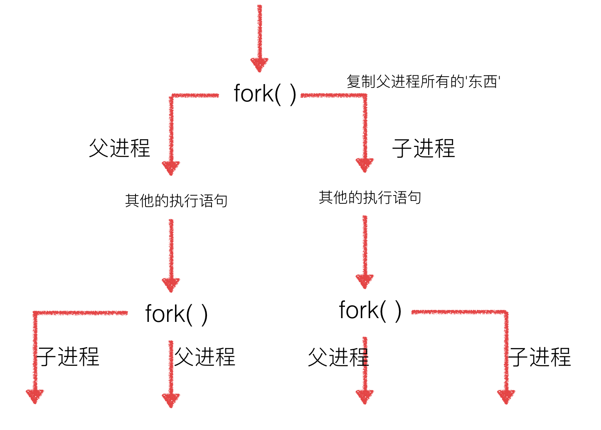
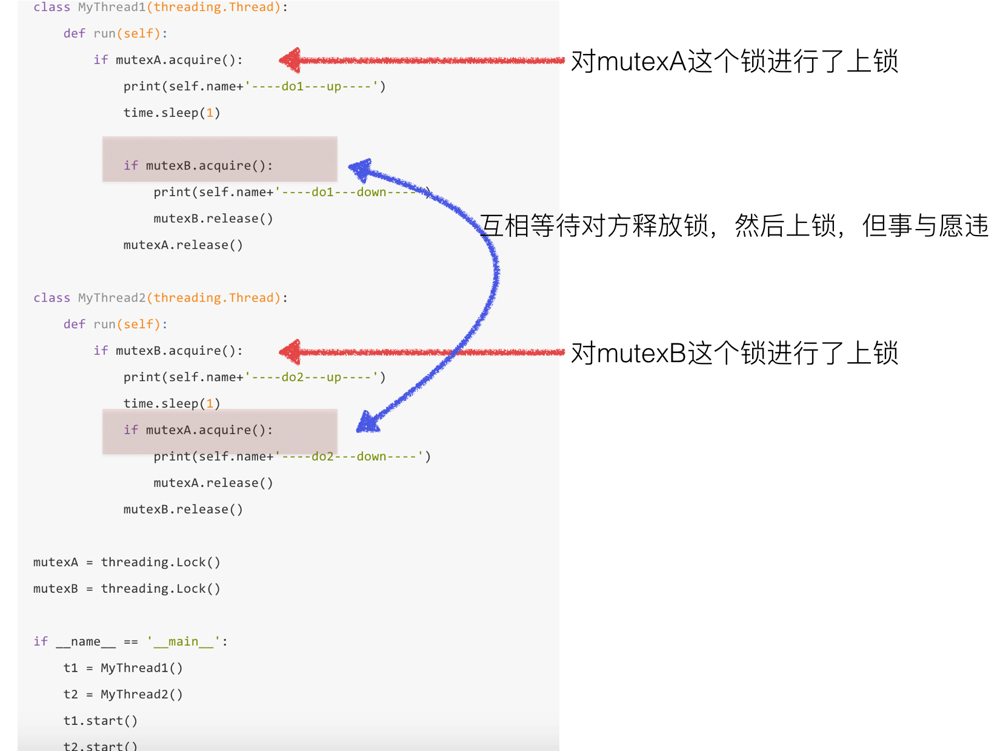

## Python 笔记 4（系统编程）

### 进程的创建 fork
#### fork()
```python
    import os

    # 注意，fork函数，只在Unix/Linux/Mac上运行，windows不可以
    pid = os.fork()

    if pid == 0:
        print('哈哈1')
    else:
        print('哈哈2')
```
#### getpid(), getppid()
```python
import os

rpid = os.fork()
if rpid<0:
    print("fork调用失败。")
elif rpid == 0:
    print("我是子进程（%s），我的父进程是（%s）"%(os.getpid(),os.getppid()))
    x+=1
else:
    print("我是父进程（%s），我的子进程是（%s）"%(os.getpid(),rpid))

print("父子进程都可以执行这里的代码")
```
#### 多进程修改全局变量
```python
#coding=utf-8
import os
import time

num = 0

# 注意，fork函数，只在Unix/Linux/Mac上运行，windows不可以
pid = os.fork()

if pid == 0:
    num+=1
    print('哈哈1---num=%d'%num)
else:
    time.sleep(1)
    num+=1
    print('哈哈2---num=%d'%num)

# 多进程中，每个进程中所有数据（包括全局变量）都各有拥有一份，互不影响
```
#### 多次 fork 问题
```python
#coding=utf-8
import os
import time

# 注意，fork函数，只在Unix/Linux/Mac上运行，windows不可以
pid = os.fork()
if pid == 0:
    print('哈哈1')
else:
    print('哈哈2')

pid = os.fork()
if pid == 0:
    print('哈哈3')
else:
    print('哈哈4')

time.sleep(1)
```


### multiprocessing
#### 示例
```python
#coding=utf-8
from multiprocessing import Process
import os

# 子进程要执行的代码
def run_proc(name):
    print('子进程运行中，name= %s ,pid=%d...' % (name, os.getpid()))

if __name__=='__main__':
    print('父进程 %d.' % os.getpid())
    p = Process(target=run_proc, args=('test',))
    print('子进程将要执行')
    p.start()
    p.join()
    print('子进程已结束')
```
```python
from multiprocessing import Process
import os
from time import sleep

# 子进程要执行的代码
def run_proc(name, age, **kwargs):
    for i in range(10):
        print('子进程运行中，name= %s,age=%d ,pid=%d...' % (name, age,os.getpid()))
        print(kwargs)
        sleep(0.5)

if __name__=='__main__':
    print('父进程 %d.' % os.getpid())
    p = Process(target=run_proc, args=('test',18), kwargs={"m":20})
    print('子进程将要执行')
    p.start()
    sleep(1)
    p.terminate()
    p.join()
    print('子进程已结束')
```
```python
#coding=utf-8
from multiprocessing import Process
import time
import os

#两个子进程将会调用的两个方法
def  worker_1(interval):
    print("worker_1,父进程(%s),当前进程(%s)"%(os.getppid(),os.getpid()))
    t_start = time.time()
    time.sleep(interval) #程序将会被挂起interval秒
    t_end = time.time()
    print("worker_1,执行时间为'%0.2f'秒"%(t_end - t_start))

def  worker_2(interval):
    print("worker_2,父进程(%s),当前进程(%s)"%(os.getppid(),os.getpid()))
    t_start = time.time()
    time.sleep(interval)
    t_end = time.time()
    print("worker_2,执行时间为'%0.2f'秒"%(t_end - t_start))

#输出当前程序的ID
print("进程ID：%s"%os.getpid())

#创建两个进程对象，target指向这个进程对象要执行的对象名称，
#args后面的元组中，是要传递给worker_1方法的参数，
#因为worker_1方法就一个interval参数，这里传递一个整数2给它，
#如果不指定name参数，默认的进程对象名称为Process-N，N为一个递增的整数
p1=Process(target=worker_1,args=(2,))
p2=Process(target=worker_2,name="dongGe",args=(1,))

#使用"进程对象名称.start()"来创建并执行一个子进程，
#这两个进程对象在start后，就会分别去执行worker_1和worker_2方法中的内容
p1.start()
p2.start()

#同时父进程仍然往下执行，如果p2进程还在执行，将会返回True
print("p2.is_alive=%s"%p2.is_alive())

#输出p1和p2进程的别名和pid
print("p1.name=%s"%p1.name)
print("p1.pid=%s"%p1.pid)
print("p2.name=%s"%p2.name)
print("p2.pid=%s"%p2.pid)

#join括号中不携带参数，表示父进程在这个位置要等待p1进程执行完成后，
#再继续执行下面的语句，一般用于进程间的数据同步，如果不写这一句，
#下面的is_alive判断将会是True，在shell（cmd）里面调用这个程序时
#可以完整的看到这个过程，大家可以尝试着将下面的这条语句改成p1.join(1)，
#因为p2需要2秒以上才可能执行完成，父进程等待1秒很可能不能让p1完全执行完成，
#所以下面的print会输出True，即p1仍然在执行
p1.join()
print("p1.is_alive=%s"%p1.is_alive())
```
#### 进程的创建-Process子类
```python
from multiprocessing import Process
import time
import os

#继承Process类
class Process_Class(Process):
    #因为Process类本身也有__init__方法，这个子类相当于重写了这个方法，
    #但这样就会带来一个问题，我们并没有完全的初始化一个Process类，所以就不能使用从这个类继承的一些方法和属性，
    #最好的方法就是将继承类本身传递给Process.__init__方法，完成这些初始化操作
    def __init__(self,interval):
        Process.__init__(self)
        self.interval = interval

    #重写了Process类的run()方法
    def run(self):
        print("子进程(%s) 开始执行，父进程为（%s）"%(os.getpid(),os.getppid()))
        t_start = time.time()
        time.sleep(self.interval)
        t_stop = time.time()
        print("(%s)执行结束，耗时%0.2f秒"%(os.getpid(),t_stop-t_start))

if __name__=="__main__":
    t_start = time.time()
    print("当前程序进程(%s)"%os.getpid())        
    p1 = Process_Class(2)
    #对一个不包含target属性的Process类执行start()方法，就会运行这个类中的run()方法，所以这里会执行p1.run()
    p1.start()
    p1.join()
    t_stop = time.time()
    print("(%s)执行结束，耗时%0.2f"%(os.getpid(),t_stop-t_start))
```

### 进程池 Pool
#### 非阻塞式
```python
from multiprocessing import Pool
import os,time,random

def worker(msg):
    t_start = time.time()
    print("%s开始执行,进程号为%d"%(msg,os.getpid()))
    #random.random()随机生成0~1之间的浮点数
    time.sleep(random.random()*2) 
    t_stop = time.time()
    print(msg,"执行完毕，耗时%0.2f"%(t_stop-t_start))

po=Pool(3) #定义一个进程池，最大进程数3
for i in range(0,10):
    #Pool.apply_async(要调用的目标,(传递给目标的参数元祖,))
    #每次循环将会用空闲出来的子进程去调用目标
    po.apply_async(worker,(i,))

print("----start----")
po.close() #关闭进程池，关闭后po不再接收新的请求
po.join() #等待po中所有子进程执行完成，必须放在close语句之后
print("-----end-----")
```
#### 阻塞式
```python
from multiprocessing import Pool
import os,time,random

def worker(msg):
    t_start = time.time()
    print("%s开始执行,进程号为%d"%(msg,os.getpid()))
    #random.random()随机生成0~1之间的浮点数
    time.sleep(random.random()*2) 
    t_stop = time.time()
    print(msg,"执行完毕，耗时%0.2f"%(t_stop-t_start))

po=Pool(3) #定义一个进程池，最大进程数3
for i in range(0,10):
    po.apply(worker,(i,))

print("----start----")
po.close() #关闭进程池，关闭后po不再接收新的请求
po.join() #等待po中所有子进程执行完成，必须放在close语句之后
print("-----end-----")
```

### 进程间通信 Queue
#### Queue 的使用
```python
#coding=utf-8
from multiprocessing import Queue
q=Queue(3) #初始化一个Queue对象，最多可接收三条put消息
q.put("消息1") 
q.put("消息2")
print(q.full())  #False
q.put("消息3")
print(q.full()) #True

#因为消息列队已满下面的try都会抛出异常，第一个try会等待2秒后再抛出异常，第二个Try会立刻抛出异常
try:
    q.put("消息4",True,2)
except:
    print("消息列队已满，现有消息数量:%s"%q.qsize())

try:
    q.put_nowait("消息4")
except:
    print("消息列队已满，现有消息数量:%s"%q.qsize())

#推荐的方式，先判断消息列队是否已满，再写入
if not q.full():
    q.put_nowait("消息4")

#读取消息时，先判断消息列队是否为空，再读取
if not q.empty():
    for i in range(q.qsize()):
        print(q.get_nowait())
```
#### Queue 实例
```python
from multiprocessing import Process, Queue
import os, time, random

# 写数据进程执行的代码:
def write(q):
    for value in ['A', 'B', 'C']:
        print 'Put %s to queue...' % value
        q.put(value)
        time.sleep(random.random())

# 读数据进程执行的代码:
def read(q):
    while True:
        if not q.empty():
            value = q.get(True)
            print 'Get %s from queue.' % value
            time.sleep(random.random())
        else:
            break

if __name__=='__main__':
    # 父进程创建Queue，并传给各个子进程：
    q = Queue()
    pw = Process(target=write, args=(q,))
    pr = Process(target=read, args=(q,))
    # 启动子进程pw，写入:
    pw.start()    
    # 等待pw结束:
    pw.join()
    # 启动子进程pr，读取:
    pr.start()
    pr.join()
    # pr进程里是死循环，无法等待其结束，只能强行终止:
    print ''
    print '所有数据都写入并且读完'
```
#### 进程池中的 Queue
```python
#coding=utf-8

#修改import中的Queue为Manager
from multiprocessing import Manager,Pool
import os,time,random

def reader(q):
    print("reader启动(%s),父进程为(%s)"%(os.getpid(),os.getppid()))
    for i in range(q.qsize()):
        print("reader从Queue获取到消息：%s"%q.get(True))

def writer(q):
    print("writer启动(%s),父进程为(%s)"%(os.getpid(),os.getppid()))
    for i in "dongGe":
        q.put(i)

if __name__=="__main__":
    print("(%s) start"%os.getpid())
    q=Manager().Queue() #使用Manager中的Queue来初始化
    po=Pool()
    #使用阻塞模式创建进程，这样就不需要在reader中使用死循环了，可以让writer完全执行完成后，再用reader去读取
    po.apply(writer,(q,))
    po.apply(reader,(q,))
    po.close()
    po.join()
    print("(%s) End"%os.getpid())
```

### 多线程-threading
#### 单线程执行
```python
#coding=utf-8
import time

def saySorry():
    print("亲爱的，我错了，我能吃饭了吗？")
    time.sleep(1)

if __name__ == "__main__":
    for i in range(5):
        saySorry()
```
#### 多线程执行
```python
#coding=utf-8
import threading
import time

def saySorry():
    print("亲爱的，我错了，我能吃饭了吗？")
    time.sleep(1)

if __name__ == "__main__":
    for i in range(5):
        t = threading.Thread(target=saySorry)
        t.start() #启动线程，即让线程开始执行
```
#### 主线程会等待所有的子线程结束后才结束
```python
#coding=utf-8
import threading
from time import sleep,ctime

def sing():
    for i in range(3):
        print("正在唱歌...%d"%i)
        sleep(1)

def dance():
    for i in range(3):
        print("正在跳舞...%d"%i)
        sleep(1)

if __name__ == '__main__':
    print('---开始---:%s'%ctime())

    t1 = threading.Thread(target=sing)
    t2 = threading.Thread(target=dance)

    t1.start()
    t2.start()

    #sleep(5) # 屏蔽此行代码，试试看，程序是否会立马结束？
    print('---结束---:%s'%ctime())
```
#### 查看线程数量
```python
#coding=utf-8
import threading
from time import sleep,ctime

def sing():
    for i in range(3):
        print("正在唱歌...%d"%i)
        sleep(1)

def dance():
    for i in range(3):
        print("正在跳舞...%d"%i)
        sleep(1)

if __name__ == '__main__':
    print('---开始---:%s'%ctime())

    t1 = threading.Thread(target=sing)
    t2 = threading.Thread(target=dance)

    t1.start()
    t2.start()

    while True:
        length = len(threading.enumerate())
        print('当前运行的线程数为：%d'%length)
        if length<=1:
            break

        sleep(0.5)
```
#### 线程执行代码的封装
```python
#coding=utf-8
import threading
import time

class MyThread(threading.Thread):
    def run(self):
        for i in range(3):
            time.sleep(1)
            msg = "I'm "+self.name+' @ '+str(i) #name属性中保存的是当前线程的名字
            print(msg)


if __name__ == '__main__':
    t = MyThread()
    t.start()
```
#### 线程的执行顺序
```python
#coding=utf-8
import threading
import time

class MyThread(threading.Thread):
    def run(self):
        for i in range(3):
            time.sleep(1)
            msg = "I'm "+self.name+' @ '+str(i)
            print(msg)
def test():
    for i in range(5):
        t = MyThread()
        t.start()
if __name__ == '__main__':
    test()
```

#### 多线程共享全局变量
```python
from threading import Thread
import time

g_num = 100

def work1():
    global g_num
    for i in range(3):
        g_num += 1

    print("----in work1, g_num is %d---"%g_num)


def work2():
    global g_num
    print("----in work2, g_num is %d---"%g_num)


print("---线程创建之前g_num is %d---"%g_num)

t1 = Thread(target=work1)
t1.start()

#延时一会，保证t1线程中的事情做完
time.sleep(1)

t2 = Thread(target=work2)
t2.start()
```
```python
from threading import Thread
import time

def work1(nums):
    nums.append(44)
    print("----in work1---",nums)


def work2(nums):
    #延时一会，保证t1线程中的事情做完
    time.sleep(1)
    print("----in work2---",nums)

g_nums = [11,22,33]

t1 = Thread(target=work1, args=(g_nums,))
t1.start()

t2 = Thread(target=work2, args=(g_nums,))
t2.start()
```
#### 多线程开发可能遇到的问题
```python
from threading import Thread
import time

g_num = 0

def test1():
    global g_num
    for i in range(1000000):
        g_num += 1

    print("---test1---g_num=%d"%g_num)

def test2():
    global g_num
    for i in range(1000000):
        g_num += 1

    print("---test2---g_num=%d"%g_num)


p1 = Thread(target=test1)
p1.start()

# time.sleep(3) #取消屏蔽之后 再次运行程序，结果会不一样，，，为啥呢？

p2 = Thread(target=test2)
p2.start()

print("---g_num=%d---"%g_num)
```
#### 互斥锁
```python
from threading import Thread, Lock
import time

g_num = 0

def test1():
    global g_num
    for i in range(1000000):
        #True表示堵塞 即如果这个锁在上锁之前已经被上锁了，那么这个线程会在这里一直等待到解锁为止 
        #False表示非堵塞，即不管本次调用能够成功上锁，都不会卡在这,而是继续执行下面的代码
        mutexFlag = mutex.acquire(True) 
        if mutexFlag:
            g_num += 1
            mutex.release()

    print("---test1---g_num=%d"%g_num)

def test2():
    global g_num
    for i in range(1000000):
        mutexFlag = mutex.acquire(True) #True表示堵塞
        if mutexFlag:
            g_num += 1
            mutex.release()

    print("---test2---g_num=%d"%g_num)

#创建一个互斥锁
#这个所默认是未上锁的状态
mutex = Lock()

p1 = Thread(target=test1)
p1.start()


p2 = Thread(target=test2)
p2.start()

print("---g_num=%d---"%g_num)
```
#### 死锁
```python
#coding=utf-8
import threading
import time

class MyThread1(threading.Thread):
    def run(self):
        if mutexA.acquire():
            print(self.name+'----do1---up----')
            time.sleep(1)

            if mutexB.acquire():
                print(self.name+'----do1---down----')
                mutexB.release()
            mutexA.release()

class MyThread2(threading.Thread):
    def run(self):
        if mutexB.acquire():
            print(self.name+'----do2---up----')
            time.sleep(1)
            if mutexA.acquire():
                print(self.name+'----do2---down----')
                mutexA.release()
            mutexB.release()

mutexA = threading.Lock()
mutexB = threading.Lock()

if __name__ == '__main__':
    t1 = MyThread1()
    t2 = MyThread2()
    t1.start()
    t2.start()

# 避免死锁：    
#   程序设计时要尽量避免（银行家算法）
#   添加超时时间等
```

#### 多个线程有序执行(同步应用)
```python
from threading import Thread,Lock
from time import sleep

class Task1(Thread):
    def run(self):
        while True:
            if lock1.acquire():
                print("------Task 1 -----")
                sleep(0.5)
                lock2.release()

class Task2(Thread):
    def run(self):
        while True:
            if lock2.acquire():
                print("------Task 2 -----")
                sleep(0.5)
                lock3.release()

class Task3(Thread):
    def run(self):
        while True:
            if lock3.acquire():
                print("------Task 3 -----")
                sleep(0.5)
                lock1.release()

#使用Lock创建出的锁默认没有“锁上”
lock1 = Lock()
#创建另外一把锁，并且“锁上”
lock2 = Lock()
lock2.acquire()
#创建另外一把锁，并且“锁上”
lock3 = Lock()
lock3.acquire()

t1 = Task1()
t2 = Task2()
t3 = Task3()

t1.start()
t2.start()
t3.start()
```
#### 生产者与消费者模式
```python
#encoding=utf-8
import threading
import time

#python2中
from Queue import Queue

#python3中
# from queue import Queue

class Producer(threading.Thread):
    def run(self):
        global queue
        count = 0
        while True:
            if queue.qsize() < 1000:
                for i in range(100):
                    count = count +1
                    msg = '生成产品'+str(count)
                    queue.put(msg)
                    print(msg)
            time.sleep(0.5)

class Consumer(threading.Thread):
    def run(self):
        global queue
        while True:
            if queue.qsize() > 100:
                for i in range(3):
                    msg = self.name + '消费了 '+queue.get()
                    print(msg)
            time.sleep(1)


if __name__ == '__main__':
    queue = Queue()

    for i in range(500):
        queue.put('初始产品'+str(i))
    for i in range(2):
        p = Producer()
        p.start()
    for i in range(5):
        c = Consumer()
        c.start()
```
#### ThreadLocal
##### 使用函数传参的方法
```python
def process_student(name):
    std = Student(name)
    # std是局部变量，但是每个函数都要用它，因此必须传进去：
    do_task_1(std)
    do_task_2(std)

def do_task_1(std):
    do_subtask_1(std)
    do_subtask_2(std)

def do_task_2(std):
    do_subtask_2(std)
    do_subtask_2(std)
```
##### 使用全局字典的方法
```python
global_dict = {}

def std_thread(name):
    std = Student(name)
    # 把std放到全局变量global_dict中：
    global_dict[threading.current_thread()] = std
    do_task_1()
    do_task_2()

def do_task_1():
    # 不传入std，而是根据当前线程查找：
    std = global_dict[threading.current_thread()]
    ...

def do_task_2():
    # 任何函数都可以查找出当前线程的std变量：
    std = global_dict[threading.current_thread()]
    ...
```
##### 使用 ThreadLocal 的方法
```python
import threading

# 创建全局ThreadLocal对象:
local_school = threading.local()

def process_student():
    # 获取当前线程关联的student:
    std = local_school.student
    print('Hello, %s (in %s)' % (std, threading.current_thread().name))

def process_thread(name):
    # 绑定ThreadLocal的student:
    local_school.student = name
    process_student()

t1 = threading.Thread(target= process_thread, args=('dongGe',), name='Thread-A')
t2 = threading.Thread(target= process_thread, args=('老王',), name='Thread-B')
t1.start()
t2.start()
t1.join()
t2.join()
```
#### 异步
```python
from multiprocessing import Pool
import time
import os

def test():
    print("---进程池中的进程---pid=%d,ppid=%d--"%(os.getpid(),os.getppid()))
    for i in range(3):
        print("----%d---"%i)
        time.sleep(1)
    return "hahah"

def test2(args):
    print("---callback func--pid=%d"%os.getpid())
    print("---callback func--args=%s"%args)

pool = Pool(3)
pool.apply_async(func=test,callback=test2)

time.sleep(5)

print("----主进程-pid=%d----"%os.getpid())
```

### 编辑记录

创建：01-13-2019 10:17 周日<br />
