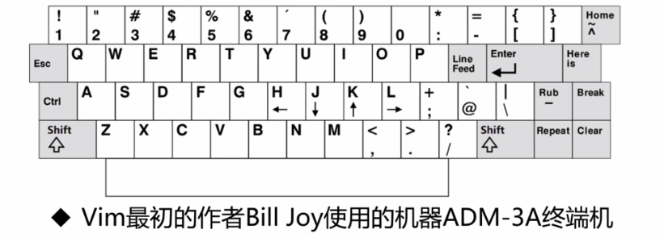
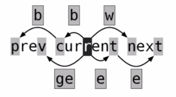

## Vim 笔记

#### Vimrc 文件
- rc: run command
- 系统级 Vimrc
- 用户级 Vimrc
- 命令模式查看帮助
  + :h vimrc
  + :help vimrc
  + :version
- 编辑
  + vim ~/.vimrc
  +:e ~/.vimrc
- 注释："

```
# vimrc 文件
set history=1000
set ruler
set hlsearch

set noincsearch
set ignorecase
set autoindex
set smartindex  自动识别语言中的缩进
set expandtab

map <F3> i<ul><CR><Space><Space><li></li><CR><Esc>I</ul><Esc>kcit
map <F4> <Esc>i<li></li><Esc>cit
```

```
# 命令模式
/set
set hls?

:set number
:set number?
:set nonumber

:let mapleader=","

:map <leader>w :w!<cr>
```

#### Vim 四种模式
- 普通
- 可视
- 插入
- 命令

>:h vim-modes-intro


#### 移动、跳转与缩进


Vim 最初的作者 Bill Joy 使用的机器 ADM-3A 终端机

##### 光标移动

|按键|含义|
|---|---|
|h|左移|
|l|右移|
|j|下移|
|k|上移|
|^/0|移动到行首/包含缩进空格|
|$|移动到行尾巴|

##### 单词和字符串移动

|w/W|正向移动到下一个单词开头（W 不包含特殊字符）|
|---|---|
|b/B|反向移动|
|e/E|正向移动下一单词结尾|
|ge|反向|



##### 跳转

|Ctrl+f/F|下一页|
|---|---|
|Ctrl+b/B|上一页|
|Ctrl+d/u|向下/上翻半页|
|gg|跳转到文件首行|
|<LineNumber>gg/G|跳转到指定行|
|G|跳转到文件最后一行|
|{g}+Ctrl+g/G|查看文件信息/{g}更加详细|

##### 缩进

|>> / :> | 右缩进 |
|---|---|
|m,n> / :m>(n-m+1)| m 到 n 行缩进|
|m>n 等价于命令 :m,m+n-1>| m 行开始共n行缩进一次|

#### 删除、复制与粘贴
##### 寄存器

|类型|含义|表示方式|举例|特点|
|---|---|---|---|---|
|无名寄存器|默认寄存器|""|"" p=p|会被最后一条覆盖|
|数字寄存器|"+{0~9}缓存最近10次操作|"0,"{1~9}|"0P,"1P|0用于复制专用，1~9用于最近9次行删除或修改记录|
|有名寄存器|26英文字母命名有名寄存器|"[a~z]/[A~Z]|"ayw|"A会通过^J追加到" a寄存器中|
|黑洞寄存器|有去无回|"_|"_dw|只想删除而不想覆盖无名寄存器|

##### 基础操作

|按键操作|定义|
|---|---|
|d=delete=cut|剪切|
|y=yank~copy|类似于复制|
|p/P=put~paste|粘贴到光标后/光标前|
|u=undo|撤销之前操作|
|Ctrl+r=redo|重做/恢复之前操作|
|yw|复制当前光标单词|
|y2w|复制正向两个单词|
|p/P=put~paste|粘贴到光标后/光标前|
|yy类似于dd|复制当前光标整行|

>:reg

>:registers

>:h reg

##### 调换字符

|按键操作|缓冲区内容|
|---|---|
|{start}|Practica lvim|
|F{space}|Practica lvim|
|x|Practicalvim|
|p|Practical vim|

##### 行剪切粘贴

|按键操作|缓冲区内容|
|---|---|
|{start}|Line1<br/>Line2|
|dd|Line2|
|p|Line2<br/>Line1|

##### 组合删除 [count]operation([count]{motion})

|x/X|删除光标下/前单个字符|
|---|---|
|dw|删除一个单词（必须在词首）|
|d{hjk}|删除到上下左右一个操作前的字符|
|d$=D|删除光标到行尾的字符|
|d^|删除光标到行首的字符|
|dd|删除当前整行|
|{n}dd|向下删除n行（包括当前行）|
|5dw|删除正向单词五次|
|3w|正向移动单词三次|
|D3w|正向删除3w动作|
|2d3w|正向删除3w动作两次|

#### 修改、查找与替换
##### 插入

|按键操作|定义|
|---|---|
|Shift+i/A|插入模式并移动到行首/尾|
|a/i|光标后/前插入|
|[n]O/o|行前/后插入n次|
|[n]+i|插入模式重复n次|

##### 转换

|按键操作|定义|
|---|---|
|~|单个字符大小写转换|
|g~w|单词大小写转换|
|g~$/g~~|整行大小写转换|
|gU/uw|单词转换成大/小写|
 
##### 查找

|按键操作|定义|
|---|---|
|F/f{char}|反向/正向查找单个字符|
|t{char}|查找字符前一个字符|
|dt{char}/df{space}|删除光标到查找字符间字符|
|/{char}|命令行查找|

##### 替换
语法：[range]s[ubtitute]/{pattern}/{string}/[flags]

|按键操作|定义|
|---|---|
|s/going/rolling/g|当前行所有going替换成rolling|
|%s/going/rolling/g|%匹配所有范围|
|Shift+r/R|替换模式|
|r|单个字符替换|
|cw|修改单个单词|
|c$/C类似于d操作符|修改光标之后内内容|

#### 缓冲区与多文件编辑
- 缓冲区
- 标签
- 窗口

##### 缓冲列列表

>:files

>:buffers

>:ls


|1| #/%a |Buf-ant.txt |第一行|
|---|---|---|---|
|缓冲区|指示状态|文件名|光标位置|

##### 缓冲区列表指示状态

|标记|含义|
|---|---|
|a|激活缓冲区，缓冲区被加载且显示|
|h|隐藏缓冲区，缓冲区被加载但不显示|
|%|当前缓冲区|
|#|交换缓冲区|
|=|只读缓冲区|
|+|已经更改缓冲区|
|-|不可改缓冲区，'modifiable' 选项不置位|

##### 缓冲区列表操作

|指令|含义|
|---|---|
|:bp[revious]|上一个缓冲区|
|:pn[ext]|下一个缓冲区|
|:bf[irst]|到第一个缓冲区|
|:bl[ast]|到最后一个缓冲区|
|:buffer Number/FileName|指定缓冲区|
|:ball|编辑所有缓冲区|
|Ctrl+^/b#|切换到前一个buffer（交换buffer）|
|:qall!|退出全部缓冲区|
|:wall!|写入全部缓冲区|
|:badd|添加一个新缓冲区，但不设置为当前缓冲区|
|:bd[elete]|删除缓冲区|
|:n,m/%bd|删除n到m编号/所有的缓冲区文件|
|:bufdo {CMD}|bufdo set number|
|:E /:bd|打开文件目录列表/返回到最初buffer|

#### 多窗口操作（分屏）与标签分组

##### 分屏

|指令|含义|
|---|---|
|Vim -O/on|水平/垂直分屏 n数字 o为Open|
|Ctrl+w c/q|关闭当前窗口/最后一个窗口时退|
|Ctrl+w s|上下分割当前打开的文件|
|:sp fileName|上下分割，并打开一个新的文件|
|Ctrl+w v|左右分割当前打开的文件|
|:vsp fileName|左右分割，并打开一个新的文件|

##### 移动分屏和尺寸变动

|指令|含义|
|---|---|
|Ctrl+w K|向上移动|
|Ctrl+w J|向下移动|
|Ctrl+w L|向右移动|
|Ctrl+w H|向左移动|
|Ctrl+w +|增加高度|
|Ctrl+w -|减少高度|
|Ctrl+w =|让所有屏的高度一致|

##### 标签操作

|指令|含义|
|---|---|
|:tabnew|新建标签页|
|:tabfind|查找并在新标签页中打开文件|
|:tabs|显示已打开标签页的列表|
|:tabclose|关闭当前标签页|
|:tabonly|仅保留当前标签页打开|
|:tabn/p/first/last|移动到下/上/第一/最后一个标签页|
|:tabm|将当前标签页放置到指定位置|

##### 标签操作和命令键

|指令|含义|
|---|---|
|gt/T|移动到下/上一个标签|
|{i}gt|移动到i位置的标签|
|noremap <C-L> <Esc>:tabnext<CR>|Vimrc 中自定义快捷键|
|noremap <C-H> <Esc>:tabprevious<CR>|Vimrc 中自定义快捷键|
|:tabe|编辑标签中的某个文件|
|:tabm 0/:tabm|移动当前tab到第一个/最后一个|
|:tabm {i}|移动当前tab到i+1位置|

#### 文本对象和宏

##### 文本对象
> {operator}{a}{object}

> {operator}{i}{object}

例：daw = Delete A Word
   + ==a== n object 包含尾部间隔空格

##### Word/Sentence/Paragraph

|textobject|说明|
|---|---|
|w|word|
|s|sentence|
|p|paragraph| 

##### 块对象

|textobject|说明|
|---|---|
|]/[|[]block|
|)/(、b|block|
|>/<、>/<|<>block|
|}/{、B|Block|
|t|tag block: <> </>|

##### Visual mode

|指令|说明|
|---|---|
|viw|选中单词|
|vis|选中句子|
|vip|选中段落|
|vi(|选中圆括号中内容|
|vi[|选中中括号中内容|
|vit|选中标签中的内容|
|v2i{|选中两层大括号之间的所有内容，数字限定选择的嵌套层数|
|v3aw|选择三个单词（包含中间的2个间隔空格）|
|v3iw|选择三个单词+间隔空格|
|可将v选择操作指令替换为c、x、d、y等操作符(operator），来针对文本对象操作||

>:h operator

##### 宏：用来解决重复的问题
###### 简单操作

|指令|说明|
|---|---|
|qa|开始录制宏到寄存器a中|
|qA|追加宏在a寄存器中追加|
|n@a|执行n遍a寄存器中的操作|
|@@|再执行一遍上一次操作|
|:n,mnormal @a|n到m行执行寄存器a宏操作|
|:let @a= '|编辑宏a寄存器|
|q|退出宏录制|

###### 宏最佳操作

- 规范光标位置：0
- 执行编辑和操作
- 移动光标到容易回放的位置：j

###### 宏保存

- viminfo / vimrc file
- 保存历史和非空寄存器
- vim 启动时读取
- 容易被覆盖

#### Visual 模式
##### 定义：在可视化模式化，可以对一个文本块的整体进行操作
##### 三种子模式

|v|激活面向字符的可视模式|
|---|---|---|
| V / shift+v|激活面向行的可视模式|
|Ctrl+v|激活面向列块的可视模式|

##### 可视化模式操作

|操作符|说明|
|---|---|
|gv|重选上次的高亮选区|
|o|切换选取边界|

#### Vim 总结

- Vim 模式
- Vim 组合
- Vim 配置多样性
- Vim 视图多样性

#### 参考
- 优雅玩转Vim
https://www.imooc.com/learn/1049

#### 编辑记录
创建 2019-02-23 12:50:00 周六<br />


